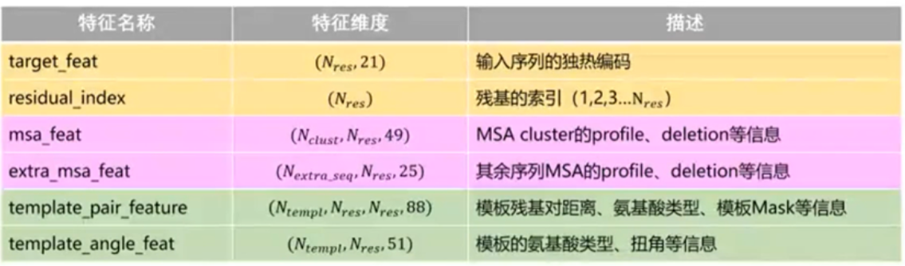
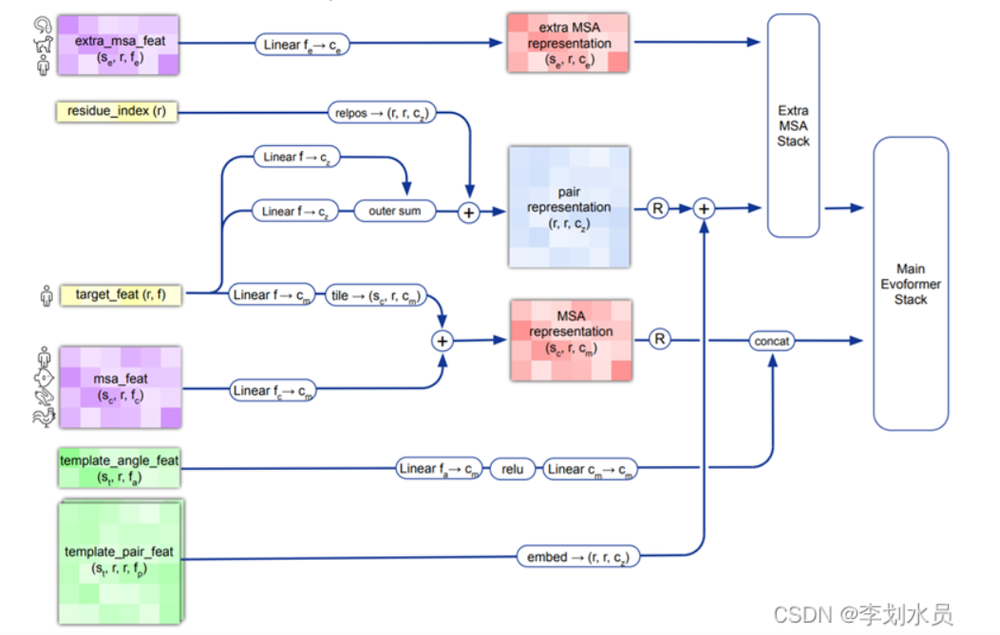

1. pipeline可以将许多算法模型串联起来，形成一个典型的机器学习问题工作流。  
Pipeline处理机制就像是把所有模型塞到一个管子里，然后依次对数据进行处理，得到最终的分类结果
2. PDB 蛋白质结构数据集，一个专门收录蛋白质及核酸的三维结构资料的数据集。
3. 数据来自蛋白质结构数据集 PDB，和包含未知结构蛋白质序列的大型数据库 UniProt，共包括约 170,000 个蛋白质结构。
4. 数据输入：
   - MSA
   - templates：模板，包含了MSA中与源序列相似的已知蛋白质结构信息
   - pairwise features：包含每个残基-残基对儿的特征。简单来说每个残基之间都有一个隐性的状态来描述其之间的关系，这个信息即被文章里称为pairwise features
   - 除了随机选取128条作为输入外，还将剩余的MSA序列对选取的作中心聚类，然后作为extra-msa信息
5. Evoformer:
  - 网络架构中接收前面提取的MSA和pair表征后，不仅有横向的attention对当前氨基酸序列的所谓位置进行attention计算，还有纵向的attention去获取其他MSA序列相同位置上氨基酸的突变与稳定性信息。MSA经过横纵attention之后再经过一个transition层，然后通过计算外积并取平均来计算pairwise features。
  - 对于pairwise features的更新采用的是三角法则原理，原因是pairwise features信息记录了残基之间的两两距离关系，因距离关系不是自由的，应该满足三角不等式

6. Structure module:
   - 输入为pair features信息（经过Evoformer网络层）、原始的序列信息以及将所有残基位置的初始化空间结构信息

7. 结论：
   - MSA以及template的信息对于最终的预测结果起到非常重要的作用
   - 对于同源已知蛋白质数量越多的目标序列，其预测结果准确率越高，而对于同源蛋白质数量很少的那些预测结果则较差
   - 模型的Evoformer和structure module部分都使用了recycling，即将输出重新加入到输入在重复refinement，进行信息的精炼。
   - 对于训练部分，先进行了预训练，然后把MSA中没有标签的序列预测出三维结构，再将这些训练结果置信度较高的结构保存下来重新进行训练

8. 步骤：
   1. 搜索同源序列和模板：给定序列A，到Uniref90、MGnify、Uniclust30、BFD数据库中搜索他的同源序列，从Unire90中得到MSA。然后到PDB70中搜索同源模板得到对应的mmCif文件
   2. 特征构造：通过同源序列和模板表示成深度学习可以作为输入的矩阵结构
      
   3. 特征表示：用这六个特征矩阵构造MSA和pair respresentation矩阵
      
   4. MSA表示与残基对表示之间互换交换信息：将共变信息融合到单一物种
      - 1）从MSA中提取蛋白质的共变信息：        
        每次取一条（行）序列进行更新：self-attention并加入残基对的信息,构建残基之间的进化关系         
        每次取1列：来自不同序列的相同残基交换信息
      - 2）把蛋白共变的信息加入到残基对表示中     
        取任意一对残基的特征，计算外积取均值以后更新到残基对中表示
      - 3）通过周围的残基对来更新当前的残基对：有助于学习到位置信息
   5. 残基的抽象表示转换成具体的三维空间坐标

9. AlphaFold2相对RoseTTAFold准确率更高，但RoseTTAFold计算支出更少速度更快

10. predicted local distance difference test (pLDDT) pLDDT 估计预测与基于局部距离差检验 Cα 的实验结构的一致性程度。
