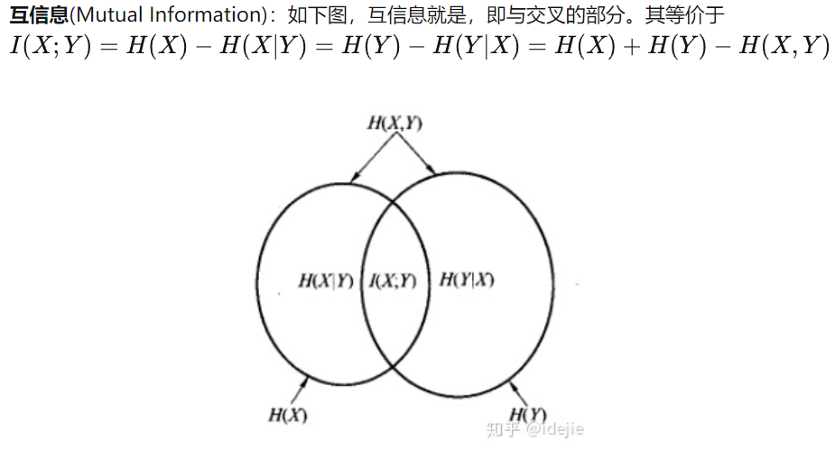

# Frustratingly Easy Transferability Estimation   快捷的可迁移性估计

## 摘要
可迁移性估计一直是选择预训练模型及其中的层进行迁移学习的重要工具，可以最大限度地提高目标任务的性能，防止`负迁移`。 现有的估计算法要么需要对目标任务进行强化训练，要么难以评估层与层之间的可迁移性。为此，我们提出了一种简单、高效、有效的可转移性算法——TransRate。通过单次遍历目标任务的示例,TransRate根据数据的特征和它们的标签之间的互信息估计可转移性。为了解决`互信息`估计的问题，我们使用coding rate（`编码信息率`）作为Entropy（`熵`）的替代估计。从特征表示的角度来看，生成的TransRate评估预训练特征的完整性（特征是否包含目标任务的足够信息）和紧凑性（每个类的特征是否足够紧凑，可以很好地泛化）。从理论上讲，我们分析了TransRate与迁移学习后性能的密切联系。   

尽管10行代码非常简单，但TransRate在32个预训练模型和16个`下游任务`的广泛评估中表现出色。

## 1. 介绍
从标准大型数据集（例如，ImageNet）和相应的预训练模型（例如，ResNet50）进行迁移学习已经成为现实世界深度学习应用的一种实际的方法，在这些应用中可以使用有限的注释数据。不幸的是，迁移学习带来的性能提升可能会有很大变化，甚至有负迁移的可能性。首先，训练预训练模型的源任务与目标任务的相关性在很大程度上决定了性能的提高。其次，在不同架构中使用预训练模型也会导致性能增益不均衡，即使对于同一对源任务和目标任务也是如此。图1(a)表明，与其他架构相比，在ImageNet上预训练的ResNet-50对目标任务CIFAR-100贡献最大。最后，要转移的最佳层对因对而异。虽然较高层编码了更多特定于源任务的语义模式，但较低层的特性更通用。特别是如果一对任务不够相似，确定最优层是为了在只传输底层特征(因为针对源任务的更高层可能会损害目标任务的性能)和传输更多的更高层特征(因为从零开始训练更多的更高层需要大量的标记数据)之间取得平衡。如图1(b)所示，在目标数据完整的情况下，最好不传输最高的三层，而在目标数据稀缺的情况下，传输除最高的两层外的所有层的测试精度最高。

$$ 图1 $$

这表明：   
> 问题：哪一个预训练的模型（可能以有监督或无监督的方式对不同的源任务进行训练）以及哪一层模型应该被迁移以最有利于目标任务？

这个研究问题推动了可转移性估计方法的设计，包括计算密集型方法和计算高效方法。开创性的工作直接遵循迁移学习的定义来衡量可迁移性，因此需要对代价高的参数优化的目标任务进行微调。尽管他们(Dwivedi & Roig)的后续行动减轻了微调的需求，但他们的先决条件仍然包括针对目标任务进行预训练的编码器。考虑到可转移性算法的主要目标是在对目标任务进行训练之前选择一个预训练模型，研究人员最近转向了计算高效的方法。可转移性估计为两个任务标签之间的负条件熵，在预训练模型的基础上加入线性分类器，解决了标记目标样本的似然估计和边缘似然估计两个代理优化问题。然而，效率的代价是未能区分层之间的可转移性，因为（Nguyen 等人，2020；Tran 等人，2019 年）仅使用标签进行估计，而（Bao 等人，2019 年；You 等人，2021 年）只考虑转移倒数第二层。

我们的动机是在不牺牲计算密集型方法在综合可转移性评价中的优点的情况下，追求一种计算高效的可转移性算法，特别是在层之间。特征和标签之间的互信息对特征表示的有效性具有很强的预测作用，可以追溯到决策树算法（Quinlan，1986），并且在最近的研究 (Tishby & Zaslavsky, 2015) 中也得到了证明。值得注意的是，在给定标签的情况下，互信息因层而异，这使得它本身成为可转移性的有吸引力的衡量标准。在本文中，我们建议利用特定层的预训练模型提取的目标示例的标签和特征之间的互信息来估计可迁移性。尽管众所周知互信息本身的估计具有挑战性，但我们通过借鉴信息论中速率失真和熵之间的密切联系(Cover, 1999)提出的编码率(Ma等人，2007)来克服这一障碍。

## 名词
1. `迁移学习`：迁移学习指的是，利用数据和领域之间存在的相似性关系，把之前学习到的知识，应用于新的未知领域。迁移学习的核心问题是，找到两个领域的相似性。找到了这个相似性，就可以合理地利用，从而很好地完成迁移学习任务。[迁移学习1](https://zhuanlan.zhihu.com/p/30108427) [迁移学习2](https://baozoulin.gitbook.io/neural-networks-and-deep-learning/di-san-men-ke-jie-gou-hua-ji-qi-xue-xi-xiang-mu-structuring-machine-learning-projects/di-san-men-ke-structuring-machine-learning-projects/ml-strategy/27-qian-yi-xue-xi-ff08-transfer-learning)
2. `负迁移`:负迁移指的是，在源域上学习到的知识，对于目标域上的学习产生负面作用。
   - 产生负迁移的原因：
     1. 源域和目标域压根不相似，谈何迁移？------数据问题
     2. 源域和目标域是相似的，但是，迁移学习方法不够好，没找到可迁移的成分。 --------方法问题
3. `互信息`：互信息是信息论中用以评价两个随机变量之间的依赖程度的一个度量。 [互信息](https://zhuanlan.zhihu.com/p/240676850)
   - 信息量：是对某个事件发生或者变量出现的概率的度量，一般一个事件发生的概率越低，则这个事件包含的信息量越大。
   - 熵(entropy)：是衡量一个系统的稳定程度。其实就是一个系统所有变量信息量的期望或者说均值。当一个系统越不稳定，或者事件发生的不确定性越高，它的熵就越高。
   
4. `编码信息率`:编码率(Code rate)或信息率(information rate) 是指在电信和信息论数据流中有用部分（非冗余）的比例。 也就是说，如果编码率是k/n，则对每k位有用信息，编码器总共产生n位的数据，其中n-k是多余的。 [编码率](https://zh.m.wikipedia.org/zh-hans/%E7%BC%96%E7%A0%81%E7%8E%87)
5. `下游任务`：真正想要解决的任务。如果你想训练一个网络无论是生成任务还是检测任务，你可能会使用一些公开的数据集进行训练，例如coco，imagenet之类的公共数据集进行训练，而这些数据集可能不会很好完成你真正想完成的内容，这就意味着在解决的实际问题的数据集上，要微调这个预训练模型，而这个任务称为下游任务。[下游任务](https://blog.csdn.net/qq_45710342/article/details/125796424)
6. `ResNet架构`：[ResNet架构](https://blog.csdn.net/sinat_34474705/article/details/106689426)
