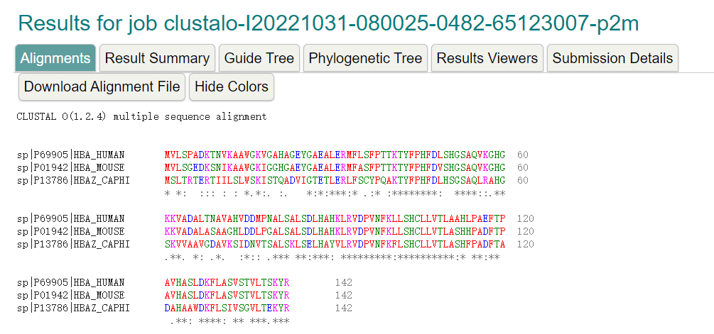

## Highly accurate protein structure prediction with AlphaFold

[url](https://www.nature.com/articles/s41586-021-03819-2)

### Summary

### Background

### Significance

### Method

### Results

### Limitations

### Questions

- [ ] 蛋白质稳定性的上下依赖性？？？？

- 背景

  > 1. 蛋白质对生命至关重要，了解<u>**蛋白质的结构**</u>可以促进对其功能的系统理解。
  > 2. 目前已经确定了大约100,000中蛋白质的结构，但这只是数十亿蛋白质序列的一部分
  > 3. 确定单个蛋白质序列的结构需要数月~数年的时间
  > 4. `蛋白质折叠问题`--仅根据蛋白质的氨基酸序列来预测蛋白质的三级结构，是近50年来的开放性研究问题。尽管取得了进展，但现有方法仍远远达不到<u>**原子级精度**</u>，特别是在没有<u>**同源结构**</u>的情况下。
  
- 一般方法：从蛋白质序列预测蛋白质的三维结构沿两种互补路径发展：
  
  1. 关注物理相互作用（physical interactions）
  
     > 物理相互作用将对分子驱动力的理解融入到蛋白质物理学的热力学和动力学模拟中。
     >
     >  The physical interaction programme heavily integrates our understanding of molecular 
     > driving forces into either thermodynamic or kinetic simulation of protein physics or statistical approximations thereof.
     >
     > 由于分子模拟的计算难度、<u>**蛋白质稳定性的上下依赖性**</u>以及难以构建准确率较高的模型，这种方法被证明即使是对中等大小的蛋白质也极具挑战性。
  
  2. 关注进化历史（evolutionary history）
  
     > 近年来，有一种方案：蛋白质结构的约束来自<u>蛋白质进化历史的生物信息学分析</u>、<u>与已解决结构的同源性</u>、<u>成对进化相关性</u>
     >
     > 该方案得益于蛋白质数据库（PDB）中实验蛋白质结构的增长 + 基因组测序的爆炸式增长 + 解释这些相关性的深度学习的发展
  
- 本文方法：Alphaford2

  > 在不知道同源结构的情况下，以原子级精度预测蛋白质结构
  >
  > 结合了关于蛋白质结构的物理和生物学知识，利用**<u>多序列比对</u>**，融入深度学习算法的设计中
  >
  > 在**<u>CASP</u>**14上验证了重新设计的AlphaFord2，大多数情况下表现出与实验相媲美的准确性，并大大优于其他方法。
  >
  > 参赛结果：
  >
  > - median backbone accuracy （主链精确度）达到了0.96 $Å r.m.s.d._{95}$ (Cα root-mean-square deviation （均方根偏差） at 95% 的残基覆盖率) (95%置信区间= 0.85–1.16 Å)
  >
  >   $År.m.s.d._{95}值越小越好$
  >
  >   Alphafold2的平均误差在1Å之间，一个C原子的直径是1.5~2Å，因此Alphafold2的误差是在原子精度内。
  >
  > - AlphaFord2 能够准确地预测域结构（图1b）
  >
  > - 当主链高度准确时， AlphaFord2 能够准确地预测侧链（图1c）
  >
  > - AlphaFord2 可扩展到具有精确结构域和domain-packing的非常长的蛋白质（图1d）
  >
  > - AlphaFord2 能够提供 precise, per-residue estimates of its reliability 
  >
  > - CASP14 中展示AlphaFold2的高准确率扩展到最近大量PDB结构样本
  >
  > - AlphaFord2 在最近发布的PDB结构也有较高的准确率（图2a），这部分预测的结构在预测后存放到了PDB数据库中，并作为全链进行分析
  >
  > - 当主链预测准确时，侧链的精确度很高（图2b）
  >
  > - AlphaFord2的置信度方法----预测局部距离差异检验(pLDDT)，能够可靠地预测相应预测的Cα的(lDDT-Cα)精度(图2c)
  >
  > - TM-Score也能够很准确的被预测（图2d）
  
- 网络结构

  > AlphaFold2通过结合新的神经网络架构和基于蛋白质结构的进化、物理和几何约束的训练过程，极大地提高了结构预测的准确性。
  
  - 输入： 一级氨基酸序列 + 同源物的比对序列作为输入 (**详细参见方法**)    预测给定蛋白质的所有重原子的3D坐标
  
  1. **Evoformer**
  
     名为Evoformer（图1e，3a）的网络构建块的关键原理是将蛋白质结构的预测视为3D空间中的图推理问题，其中图的边缘由邻近的残基定义
  
     > pair representation 编码了残基之间关系的信息（图3b）
     >
     > MSA representation的列编码了输入序列的各个残基，而行表示这些残基出现的序列
  
     MSA representation通过在MSA序列维度上求和的逐元素外积来更新对表示。 该操作在每个块内应用
  
     - `pair representation`：三角更新
  
       > 为了将氨基酸的pair representation 尽可能表示为单个3 - D结构，必须满足许多约束，包括三角不等式
  
  2. 在每一个Evoformer块后训练了一个单独的structure module，用于显示每一步后的3d结构
  
  2. 训练
  
  
  
- 训练方式：
  
  1. **<u>自我蒸馏</u>**
  
     > 先使用PDB的数据进行训练，再使用训练出来的模型预测来自 Uniclust30的约 350,000 个不同序列的结构，从预测出来的结构中选取置信度较高的与PDB再进行训练
  
     - 使用各种数据增强（裁剪和MSA子采样）使网络难以重现先前预测的结构。
  
  2. 在蛋白质序列中加入mask任务，预测masked的氨基酸
  
  2. 
  
  2. 
  
  2. 
  
- **创新**？
  
  1. 生物信息学和物理方法的结合：我们使用物理和几何归纳偏差来构建从PDB数据中学习的组件，同时尽量减少手工制作的特征，使得网络能够更有效地从PDB中的有限数据中学习，但能够应对结构数据的复杂性和多样性
  
     > AlphaFord2在没有氢键得分函数的情况下有效构建氢键
  
  2. AlphaFord2能够处理丢失的物理环境，并在具有挑战性的情况下生成精确的模型
  
     > 例如缠绕在一起的同构体或蛋白质，这些蛋白质只在存在未知的血红素基团的情况下折叠。
  
  3. AlphaFord2已经向实验界展示了它在分子替代和解释低温电子显微镜图谱方面的效用
  
  
  
  
  
- **输入**
  
  - 网络输入：人的蛋白质序列 和 3D同源结构（templates）的三维原子坐标
  
    > 通过jackhmmer 和 HHBits 工具生成MSA序列
    >
    > 数据库：BFD
  
  - 数据集
  
    > 模型训练使用数据集：2019年8月28日下载的PDB副本
    >
    > 查找模板结构：2020年5月14日下载的一份PDB副本、2020年5日13日下载的PDB70集群数据库
    >
    > 查找MSA：BFD、Uniclust30 v.2018_08  使用hh-suite v.3.0-beta.3 (version 14/07/2017)中的HHBlits 和HHSearch ；
    >
    > ​					MGnify v.2018_12、Uniref90 v.2020_01 使用HMMER3中的jackhmmer
    >
    > 序列蒸馏：Uniclust30 v.2018_08
    >
    > |              数据库名称              |                            说明                             |
    > | :----------------------------------: | :---------------------------------------------------------: |
    > |               UniRef90               |                        uniprot数据库                        |
    > |                MGnify                |              针对微生物、宏基因组的蛋白序列库               |
    > |                 BFD                  | 全称为Big Fantastic DataBase 是DeepMind团队自己构建的数据库 |
    > |              Uniclust30              |                     一个蛋白家族数据库                      |
    > |                PDB70                 |                       蛋白结构数据库                        |
    > | PDB (structures in the mmCIF format) |                       蛋白结构数据库                        |
    
    BFD的构建
    
    > 1. 首先从UniProt（Swiss-Prot&TrEMBL, 2017-11）、土壤参考蛋白质目录和海洋真核生物参考目录中收集2423213294个蛋白质序列，将这些序列聚类到30%的序列统一性，同时使用MMseqs2/linclust对较短的序列执行90%的对比覆盖率。 
    >
    >    产生345,159,030个集群。 
    >
    >    为了计算效率，我们删除了所有少于三个成员的集群，结果是61,083,719个集群。
    >
    > 2. 添加了来自Metaclust NR (2017-05;丢弃所有小于150个残基的序列)的166,510,624个代表性蛋白序列，使用MMseqs2将它们与集群代表对齐。
    >
    >    剩余的25347429个无法分配的序列被单独聚类，并作为新的聚类 ，生成最终的聚类。
    >
    > 3. 对于每一个聚类，我们使用FAMSA计算了MSA，并根据Uniclust HH-suite数据库协议计算了hmm
    
  
- **训练方案**

  >  使用PDB数据（最晚不超过2018.4），链的采样与40%序列同一性聚类的聚类大小成反比。
  >
  > 将其随机裁剪成256个残基并组装成大小为128的批次

  1. 最后一对表示被线性投影到binned distance distribution（分布图）预测中，用交叉熵损失评分
  2. 我们在输入MSA上使用随机掩蔽，并要求网络使用类似BERT的损失从输出MSA表示中重构掩蔽区域
  3. 使用**结构模块**的输出单个表示来预测每残差lDDT-Cα值。
  4. 在训练期间使用辅助侧链损失，在微调期间使用辅助结构违规损失（auxiliary structure violation loss ）。

- **结构推断**
  
  - 根据蛋白质长度的不同，预测时间不同
  
    > 在V100上训练：256个残基--4.8分钟，384个残基--9.2分钟， 2500个残基--18小时
  
  - 没有**<u>集成</u>**的网络的精度非常接近或等于有集成的精度
  
    > 在没有集成的情况下，速度提高了8倍
    >
    > 56个残基0.6 min、384个残基1.1 min和2500个残基2.1 h。
  
- Cα rmd 95%覆盖率  五次迭代
  
  > (1)对当前选择的Cα原子(使用第一次迭代中的所有Cα原子)的预测结构和PDB结构进行最小二乘对齐
  >
  > (2)选择配准误差最小的95% Cα原子。选择用于最终迭代的原子的均方根误差为r.m.s.d.95
  
- 
  
- 
  
- 
  
- **符号表示**
  
  > $N_{res}:在训练时随机裁剪的残基数$
  >
  > $N_{templ}:模型中使用的模板数量$
  >
  > $N_{all\_seq}:所有可用的MSA序列的数量$
  >
  > $N_{clust}:MSA聚类后的簇数$
  > $N_{seq}:MSA堆栈中处理的序列数量, N_{seq}  = N_{clust} + N_{templ}$
  >
  > $N_{extra\_seq}:未聚类MSA序列的数量(分采样后)$
  >
  > $N_{block}:模型块数$
  >
  > $N_{ensemble}:集成迭代的次数$
  >
  > $N_{cycle}:循环迭代的次数$	
  
- 
  
     
  
  
  

- **图 & 表**

  - 图

    1. dAlphaFold 产生高度精确的结构

       - **a：**AlphaFold 在 CASP14 数据集（n = 87 个蛋白质结构域）上相对于前 15 个条目（146 个条目中）的性能，估计了10.000个**<u>bootstrap samples</u>**。仅 Cα 原子 ($RMSD_{95}-Cα$) 

         > x：CASP队伍组号   y：准确率 + 95%的置信区间
         在某个特定的置信区间内平均预测的位置与真实的位置的误差
         >
         > Å埃。埃是长度单位。1 埃=1×10^ -10 米，10的负10次方米。

       - **b：** CASP14 目标 T1049（PDB 6Y4F，蓝色）的预测与真实（实验）结构（绿色）进行了比较

         > 晶体结构中 C terminus 的四个残基是B-factor outliers（B 因子异常值），因此未描述。

       - **c：**T1056 (PDB 6YJ1)

         > 一个良好预测的锌结合位点的示例（AlphaFold 准确预测了侧链，但它没有明确预测锌离子）。

       - **d：**CASP 目标 T1044 (PDB 6VR4) - 一个 2,180 个残基的单链 - 使用正确的域包装（correct 
         domain packing ）进行预测（在CASP之后，在没有干预的情况下使用 AlphaFold）

       - **e：**模型架构

         > 箭头 -- 描述的各个组件之间的信息流。
         >
         > s，序列数（正文中的 Nseq）；
         >
         > r，残基数（正文中的 Nres）；
         >
         > c，通道数。

    2. AlphaFold 在最近的 PDB 结构上的准确性。

       > 分析的结构比训练集中的任何结构都更**新**。应用<u>进一步过滤</u>(Further filtering)以减少冗余（参见**方法**）。

       - **a：**全链（Cα r.m.s.d. 覆盖率 95%）的直方图

         > 95%置信区间
         >
         > 该数据集从训练集中排除了具有模板（ template ）（由hmmsearch识别）的蛋白质，该模板具有超过40%的序列同一性，覆盖了超过1%的链（n=3144个蛋白质链）。
         x轴：预测的误差。 y轴：有多少比例的蛋白质 在误差里
         
       - **b：**主链和侧链精度的相关性

         > 过滤到任何观察到的侧链和分辨率好于2.5埃的结构(n=5,317个蛋白质链)；侧链进一步过滤到B因子<30埃2。如果预测扭转角在40°以内，则将rotamer归类为正确。
         >
         > 每个点聚集了一个lDDT-Cα范围，在70个lDDT-Cα以上的bin为2个单位，否则5个单位。点对应于平均精度；误差条是基于每个残基的平均值的95%置信区间（学生t检验）

       - **c：**与链上的真实准确度相比的置信度得分。

         > 线性拟合的阴影区域表示从10000个自举样本估计的95%置信区间。在配套论文39中，提供了pLDDT可靠性的额外量化作为置信度度量。

       - **d：**pTM与全链TM-Score之间的相关性。

         > 最小二乘线性拟合TM-Score=0.98×pTM+0.07（皮尔逊r=0.85）。n＝10795个蛋白链。线性拟合的阴影区域表示从10000个自举样本估计的95%置信区间。

       

- 补充
  1. `蛋白质结构`:是指[蛋白质](https://link.zhihu.com/?target=https%3A//zh.wikipedia.org/wiki/%E8%9B%8B%E7%99%BD%E8%B4%A8)分子的空间结构。作为一类重要的[生物大分子](https://link.zhihu.com/?target=https%3A//zh.wikipedia.org/wiki/%E7%94%9F%E7%89%A9%E5%A4%A7%E5%88%86%E5%AD%90)，蛋白质主要由[碳](https://link.zhihu.com/?target=https%3A//zh.wikipedia.org/wiki/%E7%A2%B3)、[氢](https://link.zhihu.com/?target=https%3A//zh.wikipedia.org/wiki/%E6%B0%A2)、[氧](https://link.zhihu.com/?target=https%3A//zh.wikipedia.org/wiki/%E6%B0%A7)、[氮](https://link.zhihu.com/?target=https%3A//zh.wikipedia.org/wiki/%E6%B0%AE)、[硫](https://link.zhihu.com/?target=https%3A//zh.wikipedia.org/wiki/%E7%A1%AB)等[化学元素](https://link.zhihu.com/?target=https%3A//zh.wikipedia.org/wiki/%E5%8C%96%E5%AD%A6%E5%85%83%E7%B4%A0)组成。所有蛋白质都是由20种不同的[L型α氨基酸](https://link.zhihu.com/?target=https%3A//zh.wikipedia.org/wiki/%E6%B0%A8%E5%9F%BA%E9%85%B8)连接形成的[多聚体](https://link.zhihu.com/?target=https%3A//zh.wikipedia.org/wiki/%E5%A4%9A%E8%81%9A%E9%AB%94)，在形成蛋白质后，这些氨基酸又被称为残基。
     - 蛋白质一级结构：组成蛋白质多肽链的线性氨基酸序列。
     - 蛋白质二级结构：依靠不同氨基酸之间的C=O和N-H基团间的氢键形成的稳定结构，主要为α螺旋和β折叠。
     - 蛋白质三级结构：通过多个二级结构元素在三维空间的排列所形成的一个蛋白质分子的三维结构。
     - 蛋白质四级结构：用于描述由不同多肽链（亚基）间相互作用形成具有功能的蛋白质复合物分子。、
     
  2. `同源结构`：在生物学种系发生理论中，若两个或多个结构具有相同的祖先，则称它们**同源**（**Homology**）。这里相同的祖先既可以指演化意义上的祖先，即两个结构由一个共同的祖先演化而来（在这个意义上，蝙蝠的翅膀与人类的手臂是同源的），也可以指发育意义上的祖先，即两个结构由胚胎时期的同一组织发育而来（在这个意义上，人类女性的卵巢与男性的睾丸同源）。

  3. `多序列比对MSA`：

     1. **序列比对**指将两个或多个序列排列在一起，标明其相似之处。序列中可以插入间隔（通常用短横线“-”表示）。对应的相同或相似的符号（在核酸中是A, T(或U), C, G，在蛋白质中是氨基酸残基的单字母表示）排列在同一列上。

     2. **多序列比对**（**多序列联配**，Multiple sequence alignment， MSA）是指把多条（3 条或以上）有系统进化关系的蛋白质分子的氨基酸序列或核酸序列进行比对，尽可能地把相同的碱基或氨基酸残基排在同一列上。这样做的意义是，对齐的碱基或氨基酸残基在进化上是同源的，即来自共同祖先（common ancestor）。

        

        > ***** -- 一列的字母完全相同
        >
        > **:**  -- 一列的字母要么相同，要么相似，不存在不相似的（大致相同的分子大小和相同的亲疏水性）
        >
        > **.**  -- 一列的字母有相似的也有不相似的
        >
        > -- 一列的字母全部不相似
        >
        > Red -- 疏水的  Blue -- 酸性的  Magenta -- 碱性的  Green -- 羟基 + 胺 + 碱性  Gray -- 其他
     
  4. `CASP`：蛋白质结构预测 (CASP) 实验的批判性评估旨在建立蛋白质结构预测的当前技术水平，确定已取得的进展，并突出未来可能最有成效的工作重点。

     >  CASP 评估每两年进行一次，使用**未在 PDB 中存放**或**公开披露**的<u>最近解决</u>的结构，因此它是对参与方法的盲测，长期以来一直作为结构预测准确性的金标准评估。
     
  5. `bootstrap samples`：有放回的抽样[参考j](https://www.analyticsvidhya.com/blog/2020/02/what-is-bootstrap-sampling-in-statistics-and-machine-learning/)

  6. `95%置信区间`：当给出某个估计值的95%置信区间为【a,b】时，可以理解为我们有95%的信心（Confidence）可以说样本的平均值介于a到b之间，而发生错误的概率为5%。
  
  7. `pLDDT`:预测局部距离差分检验 the predicted local-distance difference test
  
     `IDDT`：局部距离差异测试 (lDDT) 是一种无叠加分数，用于评估模型中所有原子的局部距离差异，包括验证立体化学的合理性。
  
     $IDDT- 计算所有重原子之间的距离; IDDT-C\alpha - 仅计算C\alpha之间的距离$
  
  7. `Self-training`：是最简单的半监督方法之一，其主要思想是找到一种方法，用未标记的数据集来扩充已标记的数据集。算法流程如下：
     （1）首先，利用已标记的数据来训练一个好的模型，然后使用这个模型对未标记的数据进行标记。
     （2）然后，进行伪标签的生成，因为我们知道，已训练好的模型对未标记数据的所有预测都不可能都是好的，因此对于经典的Self-training，通常是使用分数阈值过滤部分预测，以选择出未标记数据的预测标签的一个子集。
     （3）其次，将生成的伪标签与原始的标记数据相结合，并在合并后数据上进行联合训练。
     （4）整个过程可以重复n次，直到达到收敛。
     
  8. `网络集成`：集成学习归属于机器学习，他是一种「训练思路」，并不是某种具体的方法或者算法  [参考](https://easyai.tech/ai-definition/ensemble-learning/)
  
     1. bagging（bootstrap aggregating的缩写，也称作“套袋法”）
  
        Bagging 的思路是所有基础模型都一致对待，每个基础模型手里都只有一票。然后使用民主投票的方式得到最终的结果。
  
        大部分情况下，**经过 bagging 得到的结果方差（variance）更小**。
  
        > 1. 从原始样本集中抽取训练集。每轮从原始样本集中使用Bootstraping的方法抽取n个训练样本（在训练集中，有些样本可能被多次抽取到，而有些样本可能一次都没有被抽中）。共进行k轮抽取，得到k个训练集。（k个训练集之间是相互独立的）
        > 2. 每次使用一个训练集得到一个模型，k个训练集共得到k个模型。（注：这里并没有具体的分类算法或回归方法，我们可以根据具体问题采用不同的分类或回归方法，如决策树、感知器等）
        > 3. 对分类问题：将上步得到的k个模型采用投票的方式得到分类结果；对回归问题，计算上述模型的均值作为最后的结果。（所有模型的重要性相同）
  
     2. boosting
  
        **Boosting 的核心思路是——挑选精英。**
  
        Boosting 和 bagging 最本质的差别在于他对基础模型不是一致对待的，而是经过不停的考验和筛选来挑选出「精英」，然后给精英更多的投票权，表现不好的基础模型则给较少的投票权，然后综合所有人的投票得到最终结果。
  
        大部分情况下，**经过 boosting 得到的结果偏差（bias）更小**。
  
        > 1. 通过加法模型将基础模型进行线性的组合。
        > 2. 每一轮训练都提升那些错误率小的基础模型权重，同时减小错误率高的模型权重。
        > 3. 在每一轮改变训练数据的权值或概率分布，通过提高那些在前一轮被弱分类器分错样例的权值，减小前一轮分对样例的权值，来使得分类器对误分的数据有较好的效果。
  
     3. 差别：
  
        - **样本选择上：**
  
          Bagging：训练集是在原始集中有放回选取的，从原始集中选出的各轮训练集之间是独立的。
  
          Boosting：每一轮的训练集不变，只是训练集中每个样例在分类器中的权重发生变化。而权值是根据上一轮的分类结果进行调整。
  
        - **样例权重：**
  
          Bagging：使用均匀取样，每个样例的权重相等
  
          Boosting：根据错误率不断调整样例的权值，错误率越大则权重越大。
  
        - **预测函数：**
  
          Bagging：所有预测函数的权重相等。
  
          Boosting：每个弱分类器都有相应的权重，对于分类误差小的分类器会有更大的权重。
  
        - **并行计算：**
  
          Bagging：各个预测函数可以并行生成
  
          Boosting：各个预测函数只能顺序生成，因为后一个模型参数需要前一轮模型的结果。

​		

