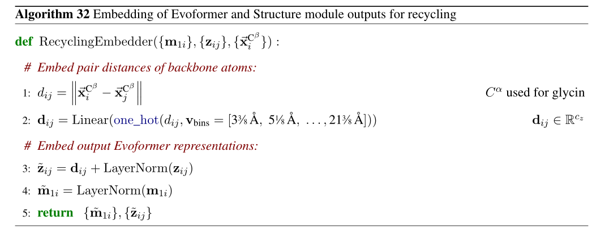
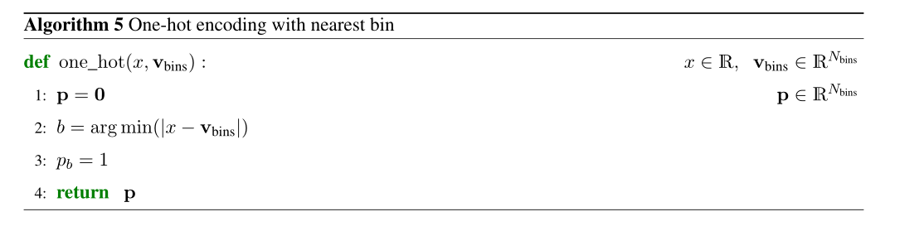

- **符号表示**

  > $N_{res}:在训练时随机裁剪的残基数$
  >
  > $N_{templ}:模型中使用的模板数量$
  >
  > $N_{all\_seq}:所有可用的MSA序列的数量$
  >
  > $N_{clust}:MSA聚类后的簇数$
  > $N_{seq}:MSA堆栈中处理的序列数量, N_{seq}  = N_{clust} + N_{templ}$
  >
  > $N_{extra\_seq}:未聚类MSA序列的数量(分采样后)$
  >
  > $N_{block}:模型块数$
  >
  > $N_{ensemble}:集成迭代的次数$
  >
  > $N_{cycle}:循环迭代的次数$

- **函数表示**

  当操作符名称封装学到的参数时，我们使用大写的操作符名称

  > **Linear**：一个线性变换，有两个学习参数$权重矩阵\mathbf{W} 和 偏置向量\mathbf{b}$
  >
  > **LinearNoBias**：线性变换，不使用$偏置向量\mathbf{b}$
  >
  > **LayerNorm**：用于层的规范化

  对于没有形参的函数，我们使用小写操作符名

  > $sigmoid, softmax, stopgrad$

  符号

  > $\odot$ 按元素相乘
  >
  > $\otimes$ 外积
  >
  > $\oplus$ outer sum
  >
  > $\mathbf{a}^T \mathbf{b}$ 两个向量的点积
  >
  > $i,j,k$ 通常为残基维度的下标
  >
  > $s,t$ 通常为序列维度的下标
  >
  > $h$ 为注意力头的维数
  >
  > eg: $\mathbf{z}_{i,j}$ 表示为 所有的pair representation
  >
  > $T = (R, \vec{t})$ 对应于坐标系的欧氏变换  $R \in \Bbb R^{3 \times 3}, \vec{t} \in \Bbb R ^ 3$
  >
  > $\circ$ 表示对原子坐标施加位置变换
  >
  >  

- **回收机制**：

  > 从Evoformer模块中回收第一行MSA Representation（人类） + pair Representation
  >
  > 从Structure module 中回收预测的所有原子坐标

  ​	

  1. 根据**所有原子坐标** 计算 $i，j$之间的距离，记为$d_{ij}$

  2. 将$d_{ij}$离散成15维的向量(使用one_hot算法)，再经过一个线性投影层，投到$c_z$维

     > $one\_hot(d_{ij}, v_{bins}), v_{bins}为一个固定向量（值 -- 历史原因确定）$
     >
     > 经过$one\_hot$，向量$\mathbf{d}_{ij}中只有使得|x - v_{bins}|的位置为1$

  3. $ \tilde z_{ij} = d_{ij} + LayerNorm(z_{ij})$

  4. $\tilde m_{1i}= LayerNorm(m_{1i})$

  