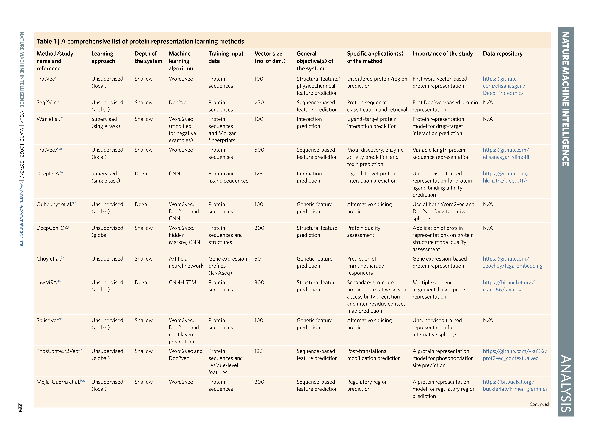
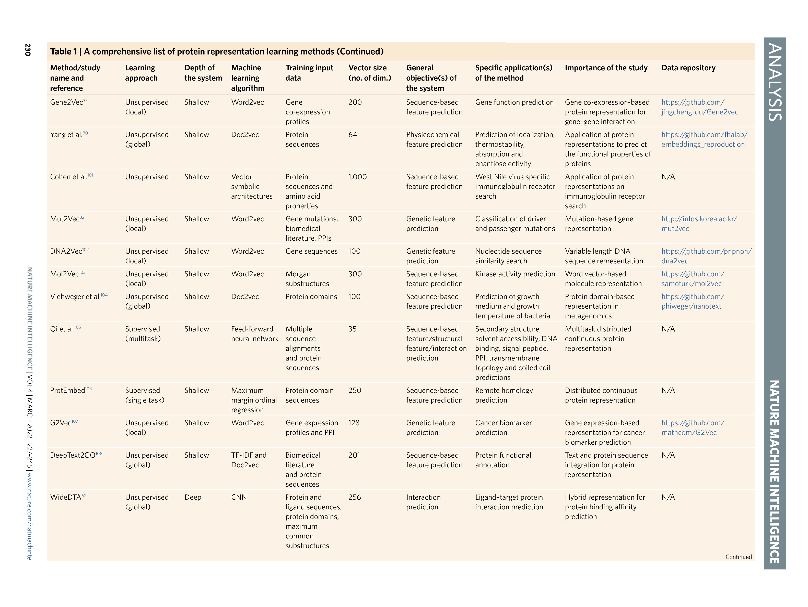
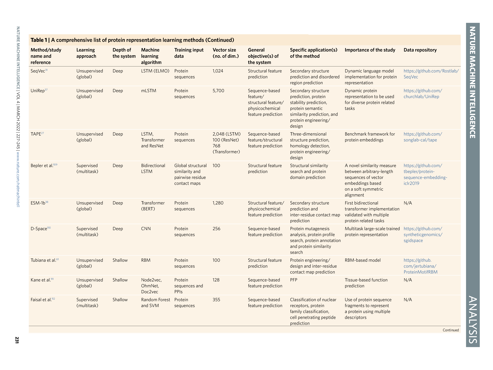
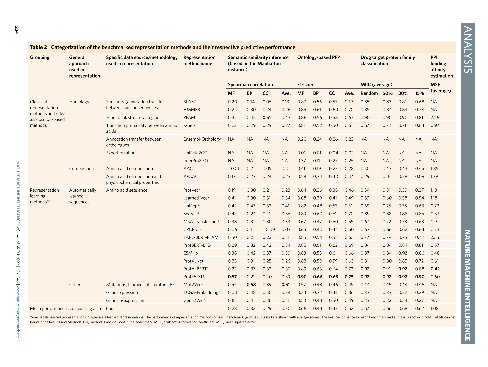
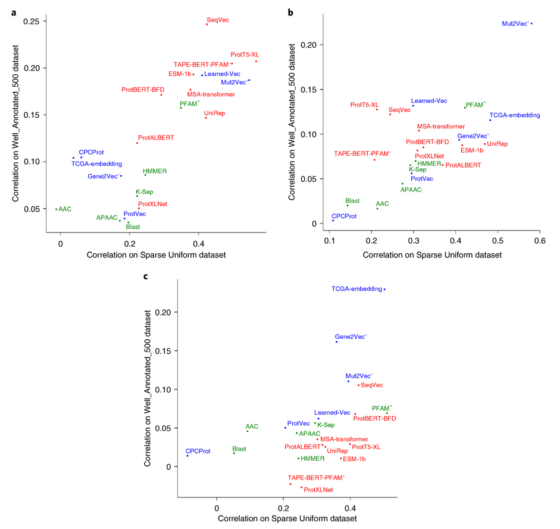
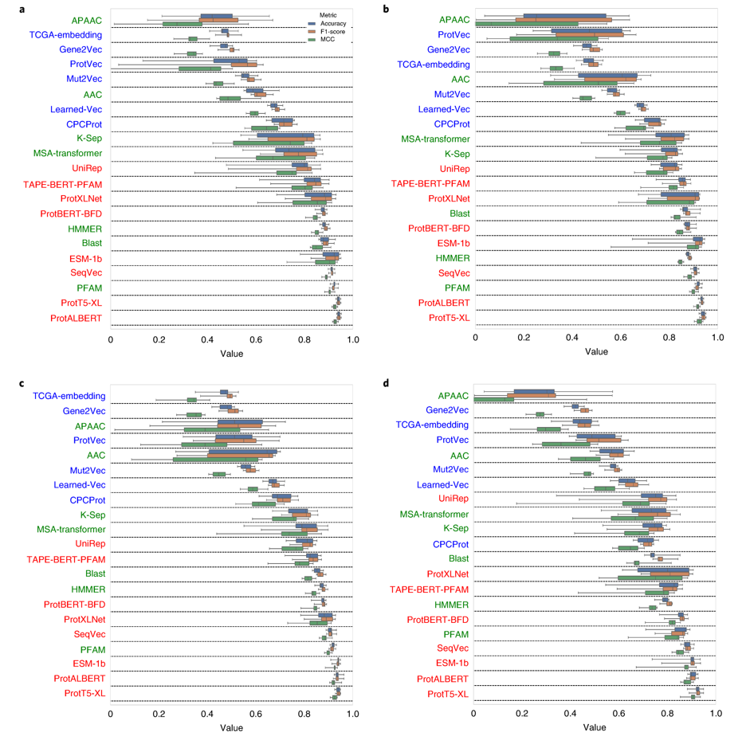
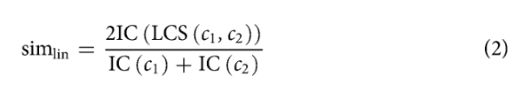

# Learning functional properties of proteins with language models

**以数据为中心的方法已被用于开发预测方法来阐明蛋白质的未表征性质;然而，研究表明，这些方法需要进一步改进，以有效解决生物医学和生物技术中的关键问题，这可以通过更好地表示现有数据来实现。新的数据表示方法大多从语言模型中获得灵感，这些语言模型在自然语言处理方面产生了突破性的改进。近年来，这些方法已被应用于蛋白质科学领域，并在提取复杂的序列-结构-功能关系方面显示出了非常有前景的结果。在本研究中，我们对每种方法进行了详细的研究，首先对每种方法进行分类/解释，然后对它们的性能进行基准测试，以预测:(1)蛋白质之间的语义相似性，(2)基于本体的蛋白质功能，(3)药物靶蛋白家族和(4)突变后蛋白质-蛋白质结合亲和力的变化。我们评估并讨论每种方法在基准测试结果、源数据集和算法上的优缺点，并与经典的模型驱动方法进行比较。最后，我们讨论了当前面临的挑战，并提出了未来的发展方向。我们相信，本研究的结论将有助于研究人员将基于机器/深度学习的表示技术应用于各种预测任务的蛋白质数据，并启发新方法的开发**。

蛋白质科学是一门交叉融合的学科，通过实验方法(如蛋白质组学)和计算方法(如分子建模、机器学习、数据科学)的结合，最终创建用于生物医学和生物技术的准确和可重复使用的方法。蛋白质信息学可以定义为蛋白质科学的计算和数据中心分支，通过蛋白质的定量方面建模。

蛋白质的功能表征对于开发新的有效的生物医学策略和生物技术产品至关重要。截至2021年5月，UniProt蛋白序列和注释知识库中约有2.15亿个蛋白质条目;然而，其中只有56万份(约0.26%)得到了专家的人工审查和注释，这表明目前的测序(数据生产)和注释(标签)能力之间存在很大差距。这种差距主要是由于从湿实验室实验及其手动管理中获得结果的成本和时间密集性。为了补充实验和基于管理的注释，正在使用计算机模拟方法。在这种背景下，许多研究小组一直致力于开发新的计算方法来预测蛋白质的酶活性1-3,生物物理性质4-6，蛋白质和配体的相互作用7-11、三维结构12-14 ,并最终预测它们的功能15-17。蛋白质功能预测(PFP)可以定义为自动或半自动地对蛋白质的功能定义进行分配。生物分子功能的主要术语被编入基因本体 (GO) 系统，这是一个概念的层次网络（即受控词汇表），用于注释基因和蛋白质的分子功能，以及它们的亚细胞定位和他们参与的生物过程18。PFP最全面的基准测试项目是功能注释的关键评估(CAFA)挑战19，参与者预测一组目标蛋白基于GO的功能关联，随后通过人工筛选确定目标蛋白的功能，用于评估**参与预测因子**的性能;到目前为止，CAFA的挑战表明PFP仍然是一个悬而未决的问题。

文献表明，复杂的计算问题，其中特征是高维的并且具有复杂/非线性关系，适合基于深度学习的技术20。这些技术可以有效地从噪声和高维输入数据中学习与任务相关的表示。因此，深度学习已经成功地应用于计算机视觉、自然语言处理和生命科学等各个领域21-24。生物分子的特征(如基因、蛋白质、RNA等)应该被提取并编码为定量/数值向量(即表征)，用于基于机器/深度学习的预测建模。给定生物分子的原始和高维输入特征，表示模型将该特征向量计算为该生物分子的简洁和正交表示。经过优化训练的监督预测系统可以有效地学习数据集中样本的特征，并使用这些表示作为输入来执行预测任务（例如，序列上的 DNA 结合区域、生化特性、亚细胞定位等）。

蛋白质表示方法可以分为两大类;(1)经典表示（即模型驱动的方法），使用预定义的属性规则生成，如基因/蛋白质之间的进化关系或氨基酸的物理化学性质(补充表1);(2)数据驱动表示，使用统计和机器学习算法(例如，人工神经网络)构建，用于预定义的任务训练，如预测序列上的下一个氨基酸(表1)。之后，训练模型的输出，即表示特征向量，可以用于其他与蛋白质信息学相关的任务，如功能预测。从这个意义上说，表示学习模型利用知识从一个任务转移到另一个任务。这个过程的广义形式被称为迁移学习25。据报道，就时间和成本而言，这是一种高效的数据分析方法26。因此，蛋白质表示学习模型最大限度地减少了对数据标记的需求27。

蛋白质表示学习是一个年轻但高度活跃的研究领域，主要受自然语言处理(NLP)方法的启发。因此，蛋白质表征学习方法在文献中经常被称为蛋白质语言模型。

文献表明，各种蛋白质表示学习方法，尤其是包含深度学习的方法，已经成功地提取了蛋白质的相关固有特征(表1)。尽管有研究评估了学习的蛋白质表示模型27-29，但仍需要进行全面的调查和基准测试，以在学习蛋白质的多个方面(包括基于本体的功能定义、语义关系、家族和相互作用)的背景下系统地评估这些方法。

在这项研究中，我们对2015年以来提出的可用的蛋白质表示学习方法进行了全面的调查，并通过详细的基准分析测量了这些方法捕获蛋白质功能特性的潜力。我们涵盖了经典和基于人工学习的方法，并深入了解了它们各自代表蛋白质的方法。我们根据它们的技术特征和应用对这些方法进行分类（补充第5节）。为了评估每个表示模型在多大程度上捕获了不同方面的功能信息，我们基于以下几个方面构建并应用了基准：(1)蛋白质之间的语义相似性推断，(2)基于本体的PFP，(3)药物靶蛋白家族分类，(4)蛋白-蛋白结合亲和力估计(见“**结果**”部分)。最后，我们讨论了结果和当前的问题，并对学习蛋白质表征的未来提供了一个展望(参见“**讨论**”部分)。

整个研究如**图1.a**所示。此外，我们还提供了我们为该任务实现的基准测试软件(`Protein Representation Benchmark, PROBE`)，该软件允许我们在上面定义的四个基准测试任务中轻松地评估任何表示方法的性能，并将结果与本研究中报告的结果进行比较。我们希望这项研究的讨论和结论能够帮助那些想要将基于机器/深度学习的表示技术应用于生物分子数据的研究人员进行预测建模。最后，我们希望这项研究能够激发新的想法，以开发新颖、复杂和强大的以数据为中心的方法来解决蛋白质科学中的开放问题。

# 结果

根据它们先前报告的预测任务的成功，和它们作为开放获取工具或准备使用预先构建的特征向量的可用性，我们选择了23种表征学习方法用于我们的基准任务(蛋白质对之间的语义相似性推断、基于GO的PFP、药物靶标蛋白家族分类和蛋白-蛋白结合亲和力预测)。平均池化用于将残基特征聚合为蛋白质特征(参见**方法**)。在选择过程中，我们还考虑了用于训练这些方法的源蛋白特征/属性(如序列、PPIs等)和算法方法，目的是涵盖各种方法。基准中包括的方法如下:Learned-Vec, SeqVec, Mut2Vec, Gene2Vec, TCGA_EMBEDDING, TAPE-BERT-PFAM, MSA-Transformer, CPCProt,ProtBERT-BFD, UniRep, ESM-1b, ProtALBERT, ProtXLNet和ProtT5-XL，以及经典的BLAST, HMMER,PFAM, AAC, APAAC, K-Sep, InterPro2GO, UniRule2GO和Ensembl-Orthology作为基线。相关文献综述，包括蛋白质表征的构建和应用(图1b)，以及基于技术和应用的分类和评价(附图15)，见**method**和**Supplementary Section 5**。从文献中获得的39种蛋白质表示学习方法，包括上述基准方法，如表1所示。

上面列出的一些方法不适用于特定的基准测试任务。例如,InterPro2GO( GO_REF: 0000042)，UniRule2GO(GO_REF: 0000104)，使用EnsemBlotholog(GO_REF:0000107)的GO预测仅适用于本体功能预测任务，因为这些方法不是基于模型的(也就是说，它们没有特征向量，只有蛋白质- GO术语关联)。此外，BLAST和基于HMMER的40个蛋白质序列相似性特征向量不能用于结合亲和力预测任务，因为该基准中的输入序列不是完整的蛋白质序列。所有方法在所有四个基准上的平均性能，总结在表 2 中。

我们绘制了基准测试任务中使用的GO术语的分布图，以直观地确认它们均匀地分布在记录的生物分子功能空间上，几乎覆盖了GO图中所有分支(**附图14**)，以表明我们基于GO的数据集具有足够的代表性。

值得注意的是，根据预测属性的分辨率，蛋白质表示学习方法可分为蛋白质或残基水平特征两类。我们的基准测试(以及它们测试的方法)大多属于前一类(部分例外是对突变后蛋白质-蛋白质结合亲和力变化的估计)。文献中也有预测残留水平特征的方法6,48,49（表 1），以及评估这些方法的基准研究27.28。

***语义相似度推断***。该分析旨在衡量有多少信息表示模型捕获了有关生物分子功能相似性的信息。在此背景下，我们使用了代表蛋白质分子功能、大规模生物学作用和亚细胞定位的GO注释。我们首先使用余弦、曼哈顿和欧几里得距离/相似性计算数据集中蛋白质表示向量之间的成对定量相似度。然后，我们将这些数据与这些蛋白质之间的基本事实(功能)相似性进行比较，这些相似性是根据这些蛋白质的实际 GO 注释使用标准语义相似性度量（例如，Lin similarity50）来测量的。为了比较不同蛋白质表示方法的成功率，我们使用三种不同的测试数据集(**方法**中详细解释)，计算了相同蛋白质对的表示向量相似性与实际基于GO的语义相似性之间的Spearman秩序相关值。相关值越高，表示的成功率越高。

**图2**和**附图5**给出了基于曼哈顿距离的结果。考虑余弦相似度和欧几里德距离测量的性能结果见**附图3、4、6、7**，相关性用星号表示(*表示相关性p值在0.05 ~ 0.005之间;\**表示0.005 ~ 0.00005之间的相关p值; ***表示相关p值等于或低于0.00005。

$$ 表1 $$

**图1|研究示意图。** a，蛋白质表征基准研究概述。 b，各种数据源/类型可用于构建表示，这些数据可用于训练无监督或有监督模型，输出表示向量可用于多种应用。

从**图2a**和**附图5**的结果来看，考虑到这三种数据集，ProtT5-XL是GO分子功能(MF)类别中最成功的表示模型。mut2vec32在GO生物学过程(BP)中表现最好，TCGA_EMBEDDING和PFAM在GO细胞成分(CC)类中相关性得分最高。SeqVec, ProtXLNet, ProtBERT-BFD和Learned-Vec是在这些类别中表现最好的其他值得注意的方法。关于此基准测试中最佳性能的更多信息见**补充小节8.1**。

$$ 表2 $$

    

**图2 |蛋白语义相似度推断基准结果**。a-c，考虑到GO类别的分子功能(Manhattan, a)生物过程(Manhattan, b)和细胞成分(Manhattan, c)，蛋白质表示方法在推断蛋白质之间成对语义相似性方面的表现(Spearman相关)。散点图显示了Sparse Uniform数据集和WellAnnotated_500数据集在x轴和y轴上的表现。评分是根据排序的rue成对基于GO的语义相似度列表(使用实验和人工管理证据代码记录的蛋白质GO注释之间的Lin similarity计算)和基于表示的成对相似度列表(使用蛋白质数值特征向量之间的“1-nomalized的曼哈顿距离”计算)之间的Spearman相关性计算的。有数据泄漏嫌疑的方法用^符号标记。颜色表示模型组(绿色，经典表征;蓝色，小规模倾斜表征;红色，大规模习得表征)。详细信息请参见**Methods**。

在建立我们的基准测试时，我们最初使用了整个参考人类蛋白质组作为测试数据集;然而，在约20.000个蛋白质之间的所有成对组合证明是一个稀疏的比较空间，使测试方法之间的差异在统计上不显著。除了数据集之外，这个基准测试中的另一个重要参数是距离度量。我们根据多个距离指标(例如，余弦、曼哈顿和欧几里得)计算性能。我们建议读者检查所有四个基准测试任务在所有提供的数据集和指标上的结果，以对表示方法做出公正的评估。.

**基于本体的PFP**。作为我们研究的第二个基准，我们的目的是评估基于分类的自动化PFP中的表示模型的成功。使用蛋白质的GO术语标注，通过有监督的机器学习分类对相同的23个蛋白质表示模型进行训练和测试。在这个基准测试中，我们倾向于使用线性分类器(即scikit-learn51提供的具有随机梯度下降的线性支持向量分类(SGD)优化器)。我们这样做是为了将分类的最终性能从分类器中分离出来。如果我们使用更复杂的分类器(例如,kernel SVM、随机森林等)，就不可能判断某个结果是由于表示模型的强大还是由于分类器进行的某些非线性转换;然而，通过使用线性边界分类器，我们确保测试中的表示能够以线性可分的方式表示蛋白质空间。我们在**补充第 8.2 节**中讨论了有关选择 GO 术语的更多细节。

利用图3中基于f1分数的热图，给出了9个GO组([low, middle，high] ×[shallow, normal，specific])的PFP性能结果。在查全率、精度、F1分数、准确性和汉明距离方面，总体GO术语预测性能结果(九组的平均值)见补充表4。值得一提的是，由于我们对实验进行建模的方式，这些性能数据优于 CAFA 挑战报告的结果。我们只在包含其真实标签的模型上运行一个测试样本作为五个任务之一（即 GO 术语），而不是在所有预测模型上运行所有测试样本。这种实验设计的选择是为了防止所有基准方法的分数在低性能区域(特别是对于难以预测的本体，例如 BP)累积，从而阻碍性能的清晰比较。我们的目的是在一个高度控制的环境中，从不同的角度比较不同的方法，而不是寻找PFP的最佳总体方法————这是CAFA挑战的目标。值得注意的是，学习到的蛋白质表示在 CAFA 挑战赛中表现出显着的表现52.53。

从**图3**和**补充表4**中可以看出，top方法在几乎所有GO组(如low、high、specific、shallow等)的MF预测任务中表现相似，其中ProtT5-XL取得了第一名和ProtBERT-BFD, SeqVec, ProtALBERT和HMMER模型以相似的分数排名第二。在BP预测任务中，ProtT5-XL再次表现最佳，ProtALBERT、SeqVec、ProtBERT-BFD和HMMER获得亚军。最后，在CC预测任务中，ProtT5-XL保持了最好的位置，ProtALBERT、SeqVec和HMMER位居第二。对这些结果的详细讨论在**补充章节8.2**中给出。

在PFP基准中，从统计上讲，一些学习的表示模型的表现比经典方法要好得多。在 CC 和 BP GO 术语预测任务中观察到的整体性能低于 MF 预测任务。这是合理的，因为大多数基于学习的方法都使用蛋白质序列数据作为输入，并且序列不是定位（因为不存在切割的信号肽）或蛋白质在大规模过程中的生物作用。我们还观察到，CC 术语预测的成功率随着注释蛋白质数量的减少而降低。类似的观察结果也适用于MF和BP类别;然而，这种影响并不明显。对于术语特异性的增加或减少，我们没有观察到类似的性能变化(即，浅术语/通用术语vs 特定术语/信息术语)。尽管如此，可以说在预测特定/信息丰富的 GO 术语方面仍然存在问题，因为它们中的许多具有少量注释蛋白质。、

**药物靶蛋白家族分类**。在我们的第三个基准分析中，我们测量了药物发现框架下的蛋白质表征的性能，并预测了ChEMBL数据库中列出的药物靶蛋白的主要家族(即酶、膜受体、转录因子、离子通道和其他)。由于这些家族是由具有不同结构特征的蛋白质组成的，这一基准分析也有望反映这些模型在学习结构特性方面的能力。此外，通过使用功能注释以外的数据源，我们试图使基准测试多样化，并从不同的角度评估表示。我们还通过准备四个不同版本的蛋白质家族注释数据集，在该基准中加入了额外的细节层，每个数据集根据不同的预定序列相似性阈值进行过滤(即随机拆分数据集和 50%，30%和 15% 相似度阈值数据集，分别使用 Uniclust50、Uniclust30 和 MMSEQ-15 聚类)，用于十倍交叉验证分析中的训练/验证数据集分割。因此，在任何情况下都不存在序列相似性大于所选阈值(即50%、30%和15%)的序列对-其中一个在训练中，另一个在验证中。基于相似性的拆分数据集统计信息如**补充表11**所示。对这些数据集进行基准测试的目的是检查有多少学习是基于简单的序列相似性，而不是学习与手头预测任务相对应的复杂和隐藏模式。在这个基准测试中，我们评估了6个小规模和8个大规模的蛋白质表示学习模型，以及6种经典的表示方法。

根据我们的多任务分类模型的平均十倍交叉验证结果(**图4**和**表2**)，ProtT5-XL和ProtALBERT在所有数据集上表现最好。PFAM、ESM-1b和SeqVec模型也具有显著的预测效果。正如预期的那样，当使用基于较低相似性分割阈值的训练/测试数据集时，性能有下降的普遍趋势;然而，这种下降在经典表示方法中比表示学习方法更明显。例如，BLAST在随机分割数据集(MCC: 0.85)上排名第六，而在50%、30%和15%基于相似性的分割数据集上排名第八、第九和第十(平均MCC分别为0.83、0.81和0.68)。另一方面，prott5-XL在几乎所有数据集上都保持了最佳性能(前三个数据集的平均MCCs为0.92，在15%的分割中为0.90)。其他基于表征学习的方法，如ESM-1b,SeqVec和ProtBERT-BFD，从随机分割提升到15%基于相似性的分割(**图4**和**表2**)。性能差异的统计显著性见**补充表8**。蛋白家族特异性评分(**附图8-12**)显示，ProtT5-XL在酶的分类中具有最好的准确性(**附图8**)。ProtT5-XL、ProtALBERT、PFAM、ProtXLNet、ESM-1b、SeqVec、HMMER和BLAST是膜受体的顶级表示方法(**附图9**)。转录因子中，ProtT5-XL、ProtALBERT、ESM-1b和PFAM居首(**附图10**)。对于离子通道，ProtT5-XL、BLAST、ProtALBERT、PFAM和ESM-1b是评分最好的模型(**附图11**)。最后，ProtALBERT、ProtT5-XL、SeqVec和ESM-1b是其他类中表现最好的(**附图12**)。

有趣的是，当相似性阈值降低到15%，甚至低于蛋白质之间传递结构和功能注释的所谓黄昏区域(即~25%的序列相似性)时，基于顶级表示学习的方法仍然表现得很好。这些结果表明，表征学习方法可能具有简单序列相似性以外的模式的能力;然而，需要进一步的调查来讨论这个话题。ProtT5-XL和ProtALBERT是这个基准测试中性能最好的模型(例如，在Uniclust50数据集上，MCC=0.92和0.91)。这种成功的潜在原因在**补充章节8.3**中有解释。

**蛋白-蛋白结合亲和力估计**。在这个基准中，我们评估了表征方法在预测实验确定的蛋白质-蛋白质结合亲和力方面的表现。更具体地说，预测了由于在其中一个相互作用伙伴中观察到的突变而导致的结合亲和力的变化。我们使用了SKEMPI数据集，该数据集包含了野生型蛋白和变异型蛋白的共结晶复合物(来自PDB)之间的PPI结合亲和力评分(即$K_D$值)。该基准评估了表征方法提取残基和/或区域级结构特征的能力，这些特征对蛋白质对之间发生的物理相互作用至关重要;以及单、双或三种氨基酸的变化如何影响结合亲和力。这一课题在理解许多遗传疾病的潜在分子机制和提出新的和有效的治疗方法方面具有重要的转化价值。

     

**图3|基于本体的蛋白功能预测基准结果**。a-c，表示基于本体的PFP基准中蛋白质表示方法在GO分子功能(a)、生物过程(b)和细胞成分(c)方面聚类性能结果(加权f1得分)的热图。颜色表示模型组(黄色，基于规则的注释方法;绿色,古典表征;蓝色，小规模学习表征;红色，大规模学习表征)。详情请参见**Methods**。

**图4|药物靶蛋白家族分类基准结果**。a-d, 图显示药物目标蛋白家族分类基准中蛋白质表示方法在Random Split (a)、UniClust50(b)、UniClut30(c)和MMSEQ-15数据集(d)上的总体性能结果(F1-score、accuracy和MCC)。根据MCC平均得分对模型进行排序，结果见**表2**。名称的颜色表示模型组(绿色，经典表征;蓝色，小规模学习表征;红色大规模学习表征)。详细信息请参见**Methods**。晶须表示最小/最大值。

关于数据集、测试、指标和扩展结果的详细信息可以在**补充章节8.4**中找到。性能得分见**图5**和**补充表9**，测试方法性能差异的统计意义见**补充表10**。

根据这些结果，ProtALBERT给出了最好的估计，MSE=0.43, MAE=4.57，相关性为90.7%。这比基于Siamese残差RCNN (PIPR)模型的PPI基线预测结果(MSE=0.63, MAE=5.48, corr=87.3%)高出约25%。请参阅**补充章节8.4**了解更多关于这个基准测试中使用的基准模型的信息。此外，ESM-1b和SeqVec模型在所有得分指标上的表现都超过了PIPR。这些结果很有趣，因为PIPR在一个监督框架中学习输入序列(以端到端方式)，旨在最大限度地提高绑定亲和度预测性能。相比之下，我们的基准中的蛋白质表示是(在训练前)通过与结合亲和力预测完全无关的任务(例如，预测序列中的下一个氨基酸)学习的，然后通过简单回归以监督的方式对结合亲和力值进行训练。这些结果可能是学习氨基酸替代信息的注意机制所致。这在过去的文献中也有体现55。此外，ProtTrans的研究表明，注意力头可能捕捉到氨基酸的相互作用这一观察结果也可以解释 ProtALBERT 产生的同类最佳性能：与我们基准测试中的其他transformer（TAPE-BERTPFAM 除外）相比，该模型的参数数量较少，但注意力头数量最多。注意头是由查询、键和值变量组成的高维关联数据结构。当给定输入（查询）时，根据查询和值之间的相似度计算注意力值。这些变量是在训练期间学习的。在蛋白质表示学习中，注意力头学习/发现序列基序，这些基序随后可以与模型其余部分定义的任务相关联。

**图5蛋白-蛋白结合亲和力评价基准结果**。a-c，表示蛋白-蛋白结合亲和力估计基准中蛋白质表示方法的性能结果的框图:Pearson相关值百分比，表示预测值与真实结合亲和力之间的相关性(值越高越好)(a)，MAE值乘以102(值越低越好)(b)和MSE值乘以102(值越低越好)(c)。每个点表示十倍交叉验证中一倍的性能。名称的颜色表示模型组(绿色，经典表征;蓝色为小规模学习表征，红色为大规模倾斜表征)。详情请参见**Methods**。黑色竖线表示PIPR研究的最佳结果。虚线表示PIPR研究的基线得分(紫色，使用贝叶斯岭回归自协方差特征的模型得分;棕色，利用贝叶斯岭回归组合-过渡-分布特征的模型得分)。晶须表示最小/最大值。每个框的颜色代表一个特定的模型的结果，并提供面板之间的比较。

# 讨论
最近，基于人工智能的蛋白质信息学研究的数量不断增加，以进一步了解序列、结构和功能之间的复杂关系。在这项研究中，我们评估了蛋白质表征学习方法的能力，以捕获蛋白质的功能特性，并最终克服在蛋白质科学、生物技术和生物医学领域的关键挑战。这些模型具有较高的表示能力和适度的资源需求(至少在推断期间)，可以(重用)用于各种任务。因此，我们认为，在不久的将来，学习表征将在蛋白质研究和开发中发挥重要作用。下面我们通过参考我们的基准测试结果来讨论与蛋白质表征学习领域相关的关键点。**表1**总结了可用的蛋白质表示学习研究和方法。在我们的四个预测基准测试中所选方法的总体性能可以在**表2**中找到。

**在蛋白质功能分析中，基于表示学习的方法往往比经典方法有更好的性能。**在我们所有的基准测试中，我们观察到学习表征(尤其是大规模模型)在预测性能方面优于经典模型，这证实了基于人工学习的数据驱动方法在表征生物分子功能特性方面的优势。另一方面，在PFP预测基准的分子功能类别中，基于隐马尔可夫模型(HMM)的生物分子相似性检测和功能注释经典方法HMMER可以与基于深度学习的蛋白质表示方法竞争。这一结果与之前的研究是一致的，因为序列相似性与蛋白质的生化特性有着高度相关，以至于使用这一特征的简单矢量表示法可以执行几乎与复杂序列建模方法一样的性能。根据这些结果，我们认为将同源性信息显式地纳入表征学习模型的训练可能导致改进考虑预测性能。这一点从基于深度学习的高性能蛋白质结构预测器中也很明显，例如RoseTTAFold和AlphaFold2，它们使用多个序列比对来显著丰富基于序列的输入。

我们相信，学习到的蛋白质表征，在它们目前的状态下，也对其他原因至关重要，这些在**补充部分9**中讨论。

**模型设计和训练数据类型/来源是表示学习的关键因素**。我们的实验表明，在蛋白质表示学习中最关键的因素之一是表示模型的设计。例如，在我们的基准测试中，我们包含了两种类型的BERT模型。TAPE-BERT-PFAM训练了3200万条蛋白结构域序列。ProtBERT-BFD用21亿个宏基因组序列片段进行训练;然而，这两者之间的性能差异并不显著(**表2**)。另一方面，使用相同的2.1B数据集训练的更复杂的模型(如ProtT5-XL)在大多数基准测试中表现得更好。因此，我们认为模型设计/架构是最重要的(与这些方法的设计/架构相关的信息在**Methods**中给出，并在**Results**部分中讨论了与预测性能相关的信息)。

关于训练数据源的另一个发现是，合并多种数据类型可能会在与功能相关的预测任务中获得更好的性能。例如，AAC和APAAC都使用氨基酸组成;然而，APAAC还在其表示模型中加入了物理化学性质，在语义相似性推断和PFP基准测试中表现明显更好。同样，Mut2Vec融合了突变配置文件、PPI和文本数据，并取得了最好的性能。特别是在语义相似度推断基准方面。

在我们的研究背景下，有可能讨论两个完全不同的源数据集:第一个用于实际的表示学习(即用于训练表示学习模型)，第二个用于不同的监督预测建模应用。这些数据集的详细信息在**补充部分9**中给出。

**在构建和评价蛋白质表示学习方法时，应考虑潜在的数据泄露问题**。数据泄漏可以定义为机器学习方法的训练和验证阶段之间的知识意外泄漏，导致性能测量过于乐观，这是性能测试中应该考虑的一个关键问题。在我们的分析中，我们观察到某些表示模型在与这些模型预先训练的任务在生物学上相关的任务中表现良好;虽然数据和实际任务是不同的。这个讨论在**补充部分9**中继续。

**蛋白质表征学习的现状与挑战**。在蛋白质表征学习领域有几个挑战。虽然大多数蛋白质表示学习模型(目前提出的)来自于NLP模型(LSTM/基于transformer的深度学习模型)，但建模语言和蛋白质之间的问题在结构上存在差异。特别是，据估计，一个美国本土人平均使用46,200个引理和多词表达;然而，一个蛋白质中只有20种不同的氨基酸，它们被表示模型以类似于语言的引理的方式处理。这些NLP模型为每个单词计算一个表示向量。类似地，当这种方法应用于蛋白质序列数据时，为每个氨基酸计算一个表示向量。这些向量被汇集起来，为每个句子/文档和蛋白质创建固定大小的向量，分别用于NLP和蛋白质信息学任务。因此，相对于NLP，在蛋白质表示学习领域，较小的模型在与较大的模型竞争时可能具有优势，因为蛋白质表示中构建模块的数量较少(即20个氨基酸)。因此，我们鼓励对蛋白质序列特异性学习模型进行更多的研究。一个相关的关键挑战是与模型尺寸相关的，**补充部分9**详细讨论这一问题。

模型可解释性对于理解模型的行为方式至关重要。在一个可解释的(即可解释的)表示中，所有的特征都以分离的形式编码，这意味着对应于向量上每个位置的特征是已知的;然而，本研究中研究的大多数习得的蛋白质表征是不可解释的。例如，蛋白质中TIM桶结构的存在可能被编码在其表示向量的第5位，而分子量信息可能在第3位和第4位之间共享。在数据科学领域，解缠研究试图将样本的实际性质与输出向量的个别位置联系起来。蛋白质表征的解缠是一个新的课题，迄今为止只有少数表示模型的开发人员对这一问题进行了研究。因此，目前还没有一种系统的方法，需要新的框架来标准化评估蛋白质表示模型的可解释性。

目前提出的大多数蛋白质表示模型只使用一种类型的数据(例如，蛋白质序列)进行训练。然而，蛋白质知识与多种类型的生物信息有关，如PPIs、post-translational modification、基因/蛋白(co)表达等。据我们所知，只有少数可用的蛋白质表示模型使用了多种类型的数据。在我们的基准研究中，Mut2Vec是一个这样的例子，它结合了PPIs、突变和生物医学文本，并且比 GO BP 和基于 CC 的 PFP 中的许多仅基于序列的表示产生了更准确的结果。我们建议整合其他类型的蛋白质相关数据，尤其是进化关系，可以进一步提高预测任务的准确性。MSA-Transformer和无向图形模型(例如，DeepSequence)通过深度学习利用同源信息。DeepSequence利用MSAs的后验分布来计算潜在因子，而MSA-Transformer则利用基于行和列的注意力来结合MSAs和蛋白质语言模型。尽管MSA-Transformer在我们的基准测试中表现出了平均的性能，但在文献中发现它在二级结构和接触预测任务中是成功的，这表明MSA-Transformer具有捕获进化关系的能力。与此相关的是，文献中明确要求整体蛋白载体能够从广义的角度有效地代表蛋白质，用于各种不同的蛋白质信息学相关目的。我们认为，可以通过连接多个先前使用不同类型的生物数据独立构建的表示向量（作为预训练的一种手段）来创建这些整体表示，并使用这些的集成版本训练新模型用于高级监督任务的向量，例如预测生物过程和/或复杂的结构特征（**补充图 13**）。构建这些整体表示的另一种方法是直接在异构图上学习，通过图表示学习整合多种类型的蛋白质关系（例如，其他蛋白质、配体、疾病、表型、功能、途径等）。

**蛋白质表示学习方法可用于设计新的蛋白质**。蛋白质设计是生物技术的关键挑战之一。合理的蛋白质设计包括评估许多不同的替代序列/结构的活性和功能，以提供最有希望的候选者进行实验验证，这可以被视为一个优化问题，为此目的需要探索的序列空间是巨大的。例如，人类蛋白质的平均长度约为350个氨基酸，其中存在 20350种不同的组合，尽管其中大多数是非功能性序列。在过去的几十年里，计算方法被用于蛋白质设计，并产生了有希望的结果，特别是在酶的设计、蛋白质折叠和组装、蛋白质表面设计方面。有效的抗体和生物传感器就这样发展起来了。其中一些方法使用了量子力学计算,分子动力学和统计力学，每一个都有极高的计算成本，需要专业知识。像Rosetta这样的主要蛋白质设计软件也有类似的缺点。最近的研究表明，基于人工学习的生成模型可以用于从头设计蛋白质。在机器学习领域，生成建模与判别建模相反，是一种生成合成样本的方法，该合成样本服从从真实样本中学习到的概率分布。这是通过有效地学习训练数据集中样本的表示来实现的。深度学习最近已成为生成模型架构的关键方法，并已应用于包括蛋白质/肽设计在内的各个领域。例如，Madani等人使用蛋白质语言模型从头设计了属于不同蛋白质家族的新功能蛋白，并通过湿实验室实验验证了他们的设计。更多的例子可以在**补充部分9**找到。这些研究表明，表征学习对于蛋白质和配体(药物)设计的新应用至关重要。

我们相信，在不久的将来，蛋白质表示学习方法将对蛋白质科学的各个领域产生影响，并在现实世界中应用，这得益于其在输入层面上集成异构蛋白质数据(即物理和化学性质/属性、功能注释等)的灵活性，以及高效提取复杂潜在特征的能力。

# 方法
在本节中，以及补充信息中的相关部分，我们解释了表示蛋白质的不同方法(**补充部分1**)、经典表示方法(**补充部分2**)、从技术角度对表示学习方法的评估(**补充部分3**)以及基准分析中包含的表示方法的详细信息(**补充部分4**)。

在**补充部分5**中，我们将蛋白质表征学习方法的技术方法(**补充图15a**)和各自出版物中报告的目标/应用(**补充图15b**)进行了分组。根据应用领域，我们将其分为5类:(1)蛋白质相互作用预测(对理解分子机制和途径至关重要)，(2)物理化学特征预测(对蛋白质工程和药物发现相关任务至关重要)，(3)遗传特征预测，(4)PFP 和(5)结构特征预测。**补充图15b**对每个领域下的主要领域和具体应用领域进行了分类。有多个目的的方法按其主要目的进行分类。大多数成功的蛋白质表征所拥有的共同特征在**补充部分6**中解释和讨论。

下面我们将介绍关于每个基准任务的数据集、建模方法、训练/测试程序和性能评估的方法细节(指标解释在**补充部分7**)。我们共享与本研究相关的源代码、模型和数据集，以便其他组可以使用这些数据对新的表示模型进行基准测试，并与我们在这里提供的结果进行比较。

我们在基准研究中包括的方法是learn-vec, SeqVec, Mut2Vec, Gene2Vec, TCGA_EMBEDDING, ProtVec, TAPE-BERT-PFAM, MSA-Transformer, CPCProt, ProtBERT-BFD, UniRep, ESM-1b, ProtALBERT, ProtXLNet, ProtT5-XL。此外，经典表示方法BLAST, HMMER， AAC, APAAC, K-Sep和PFAM,以及基于规则/关联的模型UniRule2GO, InterPro2GO 和Ensembl-Orthology。**表1**中总结了所有蛋白质表示方法的技术方面(例如，学习方法、算法等)、输入数据类型、向量大小、目标、应用程序、重要性和可用的数据存储库。

大多数的蛋白质表示学习方法产生的输出为残基特征，这意味着为蛋白质的每个氨基酸计算一个单独的表示向量。随后，聚合残基水平特征以获得蛋白质的整体表示。在我们的研究中，由于聚合过程的无偏且保守的结构，我们选择使用均值池化。需要注意的是，聚合机制是影响模型性能的关键因素，这一主题在消融研究文献中得到了评价。

**语义相似度推断基准**。为了构建完整的语义相似度推断基准数据集，我们下载了UniProtKB/Swiss-Prot数据库中的所有人类蛋白条目，以及UniProt-GOA数据库(2019_11版本)中它们的GO术语注释。带有IEA证据代码的电子推断注释被排除在数据集之外，只留下由人类专家审查的注释。随后，我们根据真实路径规则，将注释传播到GO图中断言的术语的父术语，从而丰富了数据集。我们最终确定的完整注释数据集包含14,625个不同的GO术语(其中3,374个属于MF, 9,820个属于BP, 1,431个属于CC)和326,009个注释(其中75,884个属于MF, 154,532个属于BP, 95,593个属于CC)。

我们使用GoSemSim packageR中的Lin similarity，独立计算数据集中所有蛋白质在所有GO方面(即MF、BP和CC)的真实(即基础真理)两两基于GO的语义相似性。Lin similarity 基于香农信息理论，即事件的信息含量(IC)与事件的观测概率(P)成反比;IC表示为;

Lin similarity中使用的另一个概念是least common subsumer (LCS)，它是两个GO术语在GO-directed无环图中移动到根时的第一个共同祖先。因此，Lin similarity被定义为:

更多关于语义相似度度量的信息可以在文献86中找到.

原始/未过滤的语义相似性数据集包括我们数据集中所有蛋白质之间基于成对GO语义相似性。在这组中，3077个蛋白质用于计算基于MF的成对语义相似性，6154个蛋白质用于基于BP的相似性，4531个蛋白质用于基于CC的相似性;然而，有许多注释不佳的蛋白质，其中大多数包含的功能属性信息不足，可能在相似性测量中引入了偏差。为了缓解这种情况，我们准备了一些子集，并使用这些子集进行分析。通过过滤整个数据集中的语义相似性，我们为每个GO类别(MF、BP和CC)准备了三个语义相似性子集(Well_Annotated_500、Well_Annotated_200和Sparse Uniform)。这样，总共生成了9个数据集。第一个子集，只包含按照GO注释数量排序的前500个蛋白质(在相关图中标记为Well_Annotated_500)。第二个子集只包含前200个这样的蛋白质(在相关的图中标记为Well_Annotated_200)。在上述三个数据集中，相似度分布并不均匀，导致相似度得分区域非常密集(**补充图2**)，相似度接近的对之间的等级变化导致相关性值大幅降低。这导致了低相关值周围的累积，降低了测量的鉴别能力。为了防止这种情况，我们从Well_Annotated_500个集合中的成对相似性排序列表中抽取每千个蛋白质对，以生成均匀分布的数据集。这个最终的数据集包含了40个不同蛋白质之间的247个相似度得分(相关图中标记为稀疏均匀)。因此，在我们的三个数据集中，Sparse Uniform是最容易预测的，而Well_Annotated_500是最具挑战性的。

在基准阶段，我们使用选定的表示学习方法编译了数据集中人类蛋白质条目的蛋白质表示向量：Learned-Vec、SeqVec、Mut2Vec、Gene2Vec、TCGA_EMBEDDING、ProTVec、TAPE-BERT-PFAM、MSA-Transformer、CPCProt、ProtBERT-BFD、UniRep、ESM-1b、ProtALBERT、ProtXLNet和ProtT5-XL。预先计算的向量，在可用时，直接使用;在其他情况下，这些是由各自的模型生成的。此外，经典表示方法BLAST, HMMER, AAC, APAAC, K-Sep和PFAM作为基线。随后，我们使用编译后的表示向量计算了蛋白质之间的成对相似性。用余弦相似度、归一化曼哈顿距离和归一化欧氏距离来评估成对相似度(归一化曼哈顿距离和欧氏距离通过从1中减去它们转换为相似度)。

在这一点上，我们手头有两组成对相似数组;第一个是通过考虑我们数据集中蛋白质之间的GO衍生语义相似性(即基础事实语义相似性)来计算的，第二个由直接从表示向量计算的成对相似性组成。

最后，为了观察和比较蛋白质表示模型在推断语义相似性方面的表现，我们计算了表示向量相似性和真实语义相似性的排序列表之间的Spearman等级-顺序相关性值(如**补充部分7**中所解释的)。

**基于本体的 PFP 基准测试**。 PFP 基准的数据集准备过程的详细信息将在下面分六个步骤进行说明。对于每个 GO 类别（即 MF、BP、CC）：

1. 我们分别从UniProtKB/Swiss-Prot和UniProtGOA数据库中获得了人类蛋白及其GO术语注释(两者的版本均为2019_10)。
2. 我们将所有电子标注(证据代码:IEA)从GO术语标注列表中剔除，目的是提高标注的可靠性，防止预测过程中的错误传播。
3. 对于每个 GO 术语，我们创建了一个单独的列表，其中包括注释蛋白质的补充，用于通过交叉验证进行模型训练和测试。我们使用 UniRef集群筛选每个蛋白质列表，仅从每个聚类中选择具有代表性的蛋白质条目。 UniRef 提供基于序列相似性形成的蛋白质聚类。我们使用 UniRef50 聚类，以确保每个列表中没有序列相似性超过 50% 的蛋白质序列。这里的目的是创建没有类似蛋白质的训练/测试数据集，否则可能会给分析带来偏差。
4. GO术语根据注释蛋白质的数量分为低、中或高三类。将含有2-30个注释蛋白质的GO词条放在低组，将100-500个注释蛋白质的词条放在中组，将1000多个注释蛋白质的词条放在高词组。我们故意在不同的组之间留出空白，以获得清晰的分离。
5. GO术语的特异性被确定为浅层、正常和特异性。在GO图中，在各自分支最大深度的前三分之一以内的术语被认为是浅的，在第二个三分之一的术语被归类为正常，最深的三分之一被放入特定的组中。应该注意的是，最大深度根据GO类别的不同而不同。
6. 基于步骤4和步骤5构造的组的组合;每个GO类别共形成9个GO术语组(3×3) (MF-low-specific, BP-high-shallow等)，共27个术语组(9x3)。没有GO术语对应这两个组(例如，MF-high-specific 和 CC-high-specific)，因此这些组被排除在本次分析之外。由于剩下的25个小组中大多数都是非常拥挤的，我们从每个小组中选择了5个术语进行进一步的评估。有四个组的GO术语少于5项。。因此，它们被直接合并而无需进一步选择。我们试图选择不同的GO术语，以便尽可能地将结果推广到整个功能范围。为此，我们使用Lin相似度计算GO术语之间的成对语义相似度，并为每组选择5个最不相似的术语。最终数据集的统计数据在**补充表2**中给出，所选GO术语的标识符在**补充表3**中给出。

利用这些数据集，利用SGD学习(带有Hinge loss)的线性SVM分类，构建了多任务预测模型(每个GO组一个，大部分由5个GO术语组成，每个蛋白质表示方法一个)，并在scikit-learn库中实现，共计500个预测模型(25种GO groups × 20表示方法)。这是对三种基于规则/关联的方法的预测的补充(这些方法没有基于向量的预测模型)。采用五倍交叉验证法评价各模型的性能。SGD分类器的超参数选择默认值(即错误惩罚L2范数和铰损函数)。由于线性分类模型的简单性，我们假设超参数选择的影响将是最小的。

除了之前（语义相似性预测）基准中使用的经典和基于表示学习的方法外，还包括基于规则/关联的模型、InterPro2GO、UniRule2GO 和 Ensembl-Orthology。由于基于规则/关联的方法是非基于向量的，因此它们预先计算的 GO 注释直接从 UniProt 数据库中获得（考虑到选定的 275 个 GO 术语）并用于性能评估。

**药物靶蛋白家族分类基准**。为了构建我们的药物靶蛋白家族分类基准数据集，我们使用ChEMBL数据库(v.25)，其中包含药物/化合物-靶蛋白相互作用数据（即生物活性）的精选集合，用于药物发现中的实验和计算研究和发展。考虑到 ChEMBL 中呈现的分层靶蛋白分类系统，我们使用四个广泛的靶蛋白家族，并将其余的靶蛋白归为第五类（即酶、膜受体、转录因子、离子通道等）。此外，我们还通过UniProt的关键词注释(例如，GPCR和离子通道)和UniProt酵素委员会编号注释收集了更多的人类蛋白。此外，ChEMBL人类药物靶向家族注释转运蛋白、表观遗传调节蛋白、分泌蛋白、其他细胞溶质蛋白、其他核蛋白、其他类别和未分类的单一蛋白合并为其他。最后，为了收集转录因子家族成员，在对人类转录因子进行分类的高度引用和综合研究中提供的清单。为了只包含高置信度的转录因子，我们手动过滤了这个数据集(即，消除了具有以下属性的蛋白质： TF tested by HT-SELEX?=not tested, CisBP considers it a TF? =no, TFclass considers it a TF?=no,
V aquerizas2009 classification=no, Motif status=no motif)。经过额外的人工过滤操作，剔除家族注释不明确或冗余的蛋白后，我们得到的酶、GPCRs、离子通道、转录因子等蛋白分别为4,365,835,347、1,034和1,019个。有了这些丰富的数据，我们相信考虑到人类蛋白质组中已知和潜在的药物靶点的空间，该数据集已经变得更有代表性。

我们通过将数据分成不同相似度的训练和测试数据集，构建了四个不同的数据集。为此，我们使用了基于蛋白质序列相似性的聚类方案UniClust，该方案在不同的颗粒度水平上预先计算了序列聚类，如50%，30%。此外，我们遵循与UniClust研究相同的协议，为人类蛋白质创建了另一个粒化水平为15%的聚类。我们使用UniClust协议中定义的MMSeq工具，并将我们的集群数据集命名为MMSEQ-15。我们在这些水平上分离了我们的训练/测试数据集。也就是说，对于50%的相似度水平，在训练和测试的分割中没有相似度大于50%的序列对。为了产生不同数据集上性能的公平比较，我们保持测试/验证数据集完全相同，并丢弃训练数据集中序列相似度高于所选阈值的序列（对于每个数据集的十倍交叉验证的每一折都独立重复这一操作）。原始/未过滤数据集（也对应于随机拆分数据集）中每个蛋白质家族和表示方法的蛋白质总数见**补充表7**.每个家族、交叉验证折叠和基于相似度的拆分数据集的蛋白质数量见**补充表11**。不同表示方法的数据集大小之间的微小差异是由于向量的可用性，假定可以忽略不计(最大的差异约为3%)。这些家族注释被用作目标蛋白质家族分类模型的多任务训练的类别标签。

我们通过训练每种表示方法的四个模型(一个用于随机分割，三个用于基于相似性的分割)来测试蛋白质表示方法的性能，并计算在各自测试数据集上的预测性能。结果表明，当相似性阈值从100%(即随机分割)改变为50%、30%和15%时，传统的基于序列相似性的方法与基于表示学习的新方法的性能存在差异。我们已经在**Discussion**部分对此进行了详细讨论。我们使用了scikit-learn SGD线性- svm分类器，与上一个任务一样，使用OneVsRestClassifier模式来处理多个类。分类器使用默认参数：hinge loss and L2 norm。通过十次交叉验证对模型进行训练和测试。

**蛋白-蛋白结合亲和力评价基准**。在这项任务中，我们在估计蛋白质对之间的实值结合自由能方面对蛋白质表示方法进行了基准测试。对于这项任务，我们使用了突变蛋白相互作用动力学和能量学的结构数据库 (SKEMPI) 数据集，该数据集从文献中收集了基于实验测量的蛋白质-蛋白质异二聚体复合物的基于突变的结合亲和力变化数据。SKEMPI 包括对属于 85 个蛋白质-蛋白质复合物（即 PDB 模型）的 158 个结构的 3,047 个平衡解离常数 ($K_D$) 测量。每个数据点由两个 K，蛋白质对之间的测量值组成，其中一个是野生型版本，另一个是记录的变体（具有一个或多个单个氨基酸变体）。突变后的结合亲和度变化通过两者相减来衡量。在基准测试阶段，我们使用SKEMPI中的2950个数据点作为训练/测试数据集，测量了蛋白质表示方法在直接预测结合亲和力值方面的表现(包括分别属于野生型和突变蛋白的测量)。这是Chen等人92使用的相同数据集。我们将我们的结果与他们进行比较。我们从PDB中获得了与我们的复杂结构相对应的氨基酸序列。

在这个基准测试中，我们选择了15种不同的蛋白质表示学习方法，并使用上一步获得的序列计算每种方法的蛋白质表示向量。特别是,Learned-Vec, SeqVec, Mut2Vec, Gene2Vec, TCGA_EMBEDDING, ProtVec, TAPE-BERT-PFAM, MSA-Transformer, CPCProt, ProtBERT-BFD, UniRep, ESM-1b, ProtALBERT, ProtXLNet和ProtT5-XL与经典表示方法AAC, APAAC, K-Sep和PFAM。

我们将逐元素乘法应用于表示向量对来计算估计模型的输入向量，它将蛋白质对与标签（即蛋白质-蛋白质结合亲和力值）相关联。贝叶斯岭回归被用作具有十倍交叉验证的结合自由能估计量。

我们将结果与最先进的方法进行了比较;连体残差RCNN，连体残差GRU，连体CNN;以及基线方法，如自协方差和组成-转换-分布。这些方法是在PIPR研究中提出或使用的。我们选择了与PIPR研究相同的评估器和交叉验证策略。我们还使用了与PIPR研究相同的随机状态(用于确定每个折叠中的样本)，以获得无偏比较。我们将估计结果与来自SKEMPI数据集的地面真实值进行了比较。我们使用scikit-learn训练回归模型并计算验证分数。我们使用MSE和MAE来测量性能，其细节在**补充部分7**中给出。

# 补充
1. `PFP`: 蛋白质功能预测可以定义为自动或半自动地将功能定义分配给蛋白质。
2. `GO(Gene Ontology)`: 是一项重大的生物信息学倡议，旨在统一所有物种的基因和基因产物属性的表示。
3. `湿实验室`: 湿实验室是一个科学概念，与“干实验室”相对。湿实验室相比干实验室，在进行实验时，需要用到较多的化学试剂，因而得名。相比之下，干实验室则注重通过各种仪器进行计算，以归纳出实验材料的物理模型。
4. ``GO分类`[1](https://zhuanlan.zhihu.com/p/99789859)
    - `MF`: 分子功能     单个的基因产物（包括蛋白质和RNA）或多个基因产物的复合物在分子水平上的活动，比如“催化”，“转运”
    - `BP`: 生物学过程   通过多种分子活动完成的生物学过程
    - `CC`: 细胞成分     基因产物在执行功能时所处的细胞结构位置，比如在线粒体，核糖体
5. `FDR`: false discovery rate，是统计学中常见的一个名词，翻译为伪发现率，其意义为是错误拒绝（拒绝真的（原）假设）的个数占所有被拒绝的原假设个数的比例的期望值。
6. `PPI`: 蛋白-蛋白相互作用 [PPI](https://www.laitimes.com/zh/article/1qq7f_1x03w.html)
7. `TCGA`: 癌症基因组图谱
8. `ECE`:指数交叉熵 (ECE) ，该指标是模型每个令牌平均损失的指数。
9. `K折交叉验证`:每次的测试集将不再只包含一个数据，而是多个，具体数目将根据K的选取决定。比如，如果K=5，那么我们利用五折交叉验证的步骤就是：
   - 将所有数据集分成5份
   - 不重复地每次取其中一份做测试集，用其他四份做训练集训练模型，之后计算该模型在测试集上的$MSE_i$
   - 将5次的$MSE$取平均得到最后的MSE [参考](https://zhuanlan.zhihu.com/p/24825503)
10. 面临的挑战：
   - 建模语言和蛋白质的问题之间存在结构差异。
   - 模型的可解释性
   - 迄今为止提出的大多数蛋白质表示模型仅使用一种类型的数据。研究人员建议整合其他类型的蛋白质相关数据，尤其是进化关系，可能会进一步提高预测任务的准确性。

11. 改进： 第一遍可通读，第二遍可细读
    数据集
    实验怎么进行  怎么验证 Test的细节
    尽量搞懂文章 
    
