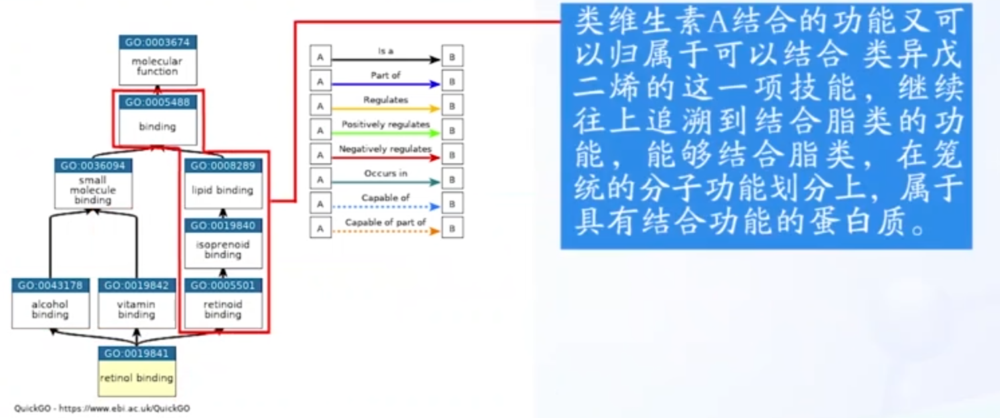

1. **`基因本体(GO)`**  [参考](https://www.bilibili.com/video/BV1k54y1f73E?spm_id_from=333.337.search-card.all.click&vd_source=99ad80d05162c9174702fdc8b7cf5017)
  - 为什么要使用GO？   
     蛋白质的功能，或者说，基因的功能千差万别，而不同的研究者和数据库对相同或者相似功能的定义和表述也不一样，所以，我们需要一套**标准化**的词汇，来描述每个新发现的基因功能。
  - 三大独立的基因本体(把基因功能分为三大类)
    1. 分子功能(molecular function):基因产物进行的分子水平**活动**,例如“催化”或“运输”。
    2. 细胞组分(cellular component)
    3. 生物过程(biological process):由多种分子活动完成的更大的过程或“生物程序”,例如“嘧啶核碱基生物合成过程”或者“葡萄糖跨膜转运”。
  - GO不仅规范了词汇，还尽可能明确这些词汇之间的关系，建立了一个结构网络    
    >  GO会把一组词汇，也就是本体，通过一些特定的关系，比如is a或者 part of这样的关系关联起来形成一个具有层次结构的有向无环图,有向无环图就是只有方向，不会有回路的这么一个严格遵守等级制的图。
    
  - 三个GO本体分别由一个单独的根本体术语表示。三个GO本体是不相交的，这意味着在来自不同本体的术语之间没有关系。
  - 可以通过检索蛋白质序列数据库中的相似蛋白质，然后通过**相似蛋白质的GO功能**来预测**未知蛋白质的功能** 
  - **GO注释**: 主要是为GO terms提供注释，也就是描述这个GO terms有什么功能（例如某些基因的产物是什么，是蛋白质，还是非编码RNA，还是大分子等）。一个GO注释由一个与GO term相关的特定参考和基因产物构成，GO注释的来源各异，下表就说明了GO注释的各种来源代码，其中`*`部分表示证据来源可靠性比较高: [参考](http://rvdsd.top/2018/04/02/BIoTools/GO%E5%88%86%E6%9E%90%E7%AC%94%E8%AE%B0/)
    

2. **`蛋白质家族`**:直接针对蛋白质的相似性，来对蛋白质进行分类
   - 一个家族的蛋白质必然具有**相似的结构**和**相近的功能**，并且，同一蛋白质家族的成员被普遍认为是**同源**的
   - **同源蛋白**：氨基酸序列具有明显的相似性,在不同生物体或同一机体内行使相同或相似功能的蛋白质。 
   - `超家族`:超级大家族，包含一些远亲
   - `子家族`:子家族就是一个家族下的小分类单元
   > 在建立了蛋白质家族的概念以后，对蛋白质进行功能的预测，在某种程度上就意味着将但蛋白质归类到某个家族

3. **`InterPro`**:蛋白质二级数据库
   
   - 把蛋白质序列与InterPro已经注释的片段进行可视化对比
   - 根据查询结构**推断**序列GO功能注释信息
   - 查询数据库中与这条序列相似的序列信息
   
4. **`CAFA`**:对功能注释的严格评估是一项旨在提供对专用于以下方面的计算方法的大规模评估的实验:预测蛋白质功能。
   - 不同的算法通过预测他们的能力来评估基因本体论(GO)别中的分子功能,生物过程和细胞组分。  
   - 实验包括两个轨道：（i） 真核生物 跟踪，（ii） 原核生物 追踪。在每个轨道中，组织者都提供了一组目标。参与者应在提交截止日期之前提交其预测，然后根据一组特定指标对其进行评估。

5. 序列可以很轻易的获取氨基酸的物理化学性质，故而在早期的经典蛋白质表示方法中被广泛使用，氨基酸的物理化学性质与蛋白质的结构和功能特性密切相关。
6. Chen等人提出了`IFeature5`,这是一个Python包，用于构建基于结构和物理化学特征的蛋白质结构向量，仅使用序列作为输入。
7. **蛋白质表示学习方法**从一个或多个资源（例如，序列、相互作用等）收集数据，并采用监督或非监督学习来训练模型，该模型输出表示向量以用于其他蛋白质信息学相关应用。[无监督学习1](https://easyai.tech/ai-definition/unsupervised-learning/) [无监督学习2](https://www.cvmart.net/community/detail/1695)
   - 监督学习需要标记数据，例如用 GO 术语等生物分子功能定义注释的基因/蛋白质条目。
   - 无监督学习不需要标记，因此很容易适用于多种类型的生物医学数据。（需要更大的数据量和计算能力）
8. 由于word2vec依赖于有限窗口中的单词共现，它忽略了可能包含关键语义信息的更大上下文。对于基于蛋白质序列的表示，这个较大的上下文可以是整个蛋白质序列。另一种嵌入方法doc2vec在一定程度上包含了整个上下文，并且在选定任务上的表现优于word2vec。

9. 方法中包含四个类别：
   - 基于规则/关联的系统
     1. UniRule2GO
     2. InterPro2GO
     3. EnSembl-Onthology
   - 蛋白质表示和注释的经典方法(基于矢量)
     1. BLAST(基于同源性)
     2. HMMER(基于同源性)
     3. AAC(基于氨基酸组成)
     4. APAAC(基于氨基酸组成)
     5. K-sep(基于进化)
     6. 基于同源性：通过查询目标蛋白的特征/注释蛋白数据库，以及源基因/蛋白的现有注释，根据同源性转移到目标蛋白，通过统计显著序列相似性进行评估   
     在蛋白质功能预测中，我们没有选择在最相似的序列之间直接转移注释，因为这种应用不会产生与基于向量的蛋白质表示学习方法的结果直接可比的结果。
   - 蛋白质表示学习中的小规模模型
   - 蛋白质表示学习中的大规模模型

10. 序列可以很轻易的获取氨基酸的物理化学性质，故而在早期的经典蛋白质表示方法中被广泛使用，氨基酸的物理化学性质与蛋白质的结构和功能特性密切相关。
11. 在PFAM表示向量中，每个蛋白质都用一个基于相应蛋白质的PFAM结构域注释的存在和不存在的二进制向量来表示
12. 在`AAC`(氨基酸组成)方法中，使用氨基酸频率矩阵来描述蛋白质。在AAC中，每一个蛋白质由20维的向量表示，每一维对应一个不同的氨基酸，使用iFeature工具创建AAC的特征向量、
13. 基于氨基酸组成的经典表示方法的一个普遍问题是==难以包含残基序列信息==。
14.  `APAAC`利用氨基酸的物理化学特性以及氨基酸组成，将序列顺序耦合和疏水关联结合起来，该模型计算一个具有80维(默认)的表示向量，其中前20个表示单个氨基酸组成，其余表示疏水性/亲水性相关因子。
15. `PSSM`：[参考](http://www.nohup.cc/article/112/)
16. `K-Sep`：进化信息。最终表示向量大小为400*1，每个维度代表从一种氨基酸到另一种氨基酸的特定转换概率(20*20).  或许原本没有的氨基酸标记为0？
    - 据报道，该方法在预测IV型分泌效应器方面是成功的
17. `k-mer`： k长度的氨基酸序列
18. `ProtVec`：小规模蛋白质表示方法，将蛋白质表示为100维向量。将每个蛋白质序列视为一个句子，将每个k-mer视为一个单词。
    - 评估了ProtVec在预测蛋白质的质量、体积、极性、疏水性和电荷方面的性能，以及它在无序蛋白质分类中的准确性。
19. `Learned-Vec`：yang等人使用`doc2vec`算法在非重叠k-mers上构建大小为4-128维的蛋白质向量
    - 通道视紫红质 (ChR) 定位
    - 细胞色素 P450 热稳定性
    - 视紫红质吸收波长
    - 封闭设计的环氧化物水解酶对映选择性
    > 使用MAE(平均绝对误差，计算预测值与真实值之间变化量度)计算性能值，Kendall rank相关系数计算序数精度，对数似然函数。

20. `Mut2Vec`：Kim等人使用300维的蛋白质向量，模型的目的是**根据其致病作用对突变进行分类**，构建模型使用到突变共现信息、蛋白质-蛋白质相互作用(PPI)网络(来自BIoGRID)和生物医学文献(来自PubMed)。该模型是在替代方案中选择了一个模型，在共现信息上利用Skip-gram算法作为最终表示。在MutVec工作流程中，首先使用突变共现信息和PubMed文本来计算表示向量，PPI数据在后期阶段集成，
21. `Gene2Vec`由Du等人提出，在该模型中使用skip-gram算法计算200维向量来表示基因。输入数据、 gene coexpression profiles来自于**GEO**数据库
    
    > 目的：预测基因-基因相互作用
    
22. `TCGA_EMBEDDING`表明学习到的蛋白质表征有可能解释细胞和疾病的分子生物学机制

23. PFP中GO术语分类：
  - GO术语特异性： GO术语的特异性（即GO图的位置）与其信息量之间存在关系。带有 GO 术语“分子功能的负调控”的注释过于笼统。这些 GO 项通常位于GO图的根附近，称为“shallow”。如果相同的蛋白质用术语“双链端粒DNA结合的负调控”注释，这是前者的后代，注释会提供更多信息。为了考虑到这一点，我们将 GO 术语分为三个类别：shalllow、normal和specific；根据它们在GO图上的深度（参见方法）。
   - 创建了三个类别，指出注释到 GO 术语的蛋白质数量：低，中，高

24. `SeqVec`具有较低的计算成本，但能够与使用大量数据集训练的大型模型相竞争。使用ELMO模型(双向LSTM)
25. 在补充图5中，low组和specific组是具有挑战性的两个组。
    - 蛋白质数量少对BP和CC类别影响较大，对MF类别影响较小
    - GO术语各特异性差异对实验结果影响不大

#  000
1. 数据泄露：训练别的任务过程中，使用的数据包含了将要进行的其他任务的一些信息。
   - Mut2Vec17使用蛋白-蛋白相互作用数据进行训练，我们发现该模型在预测BP和CC相关任务方面是成功的。这是非常可能的两个相互作用的蛋白质定位在相同的细胞室或在相同的生物过程中发挥作用。
   - PFAM表示直接使用PFAM域注释构造。由于蛋白质结构域与功能直接相关，这种情况可以被评估为隐式数据泄漏。
   > 综上所述，我们怀疑Gene2Vec、Mut2Vec、PFAM和TAPE-BERT-PFAM在语义相似性推断和基于本体的PFP基准中，以及Mut2Vec、PFAM和TAPE-BERT-PFAM在药物靶蛋白家族分类基准中可能存在数据泄漏。
2. 挑战
  - 模型大小――参数数量； 英语句子平均大小为21.7个单词，人类蛋白质中氨基酸中位数为361的145次幂
  - 模型大小不一定与蛋白质模型的性能相关，但在某些情况下，大模型表现比小模型要好。
    > 93M参数的SeqVec在大多数基准测试中可以与3B参数的ProtT5-XL竞争
    ==投入时间和资源将不同类型的生物数据整合到模型中将是一个更好的选择==
  - 蛋白质表示学习方法可用于设计新的蛋白质

基于本体的蛋白质功能预测：

“Ontology_based_function_prediction_5cv_mean_representation_name.tsv”：该文件包括所选数据集上所选表示方法的蛋白质功能预测性能结果（5 倍交叉验证的平均值）。
“Ontology_based_function_prediction_5cv_std_representation_name.tsv”：该文件包括 5 折交叉验证的每一折的预测性能分数的标准偏差值。
有关数据集的详细说明，请参阅我们题为“蛋白质表示学习方法的评估：定量分析”的论文中题为“基于本体的蛋白质功能预测基准”的方法小节。

1. 蛋白质进化
2. gene coexpression profiles